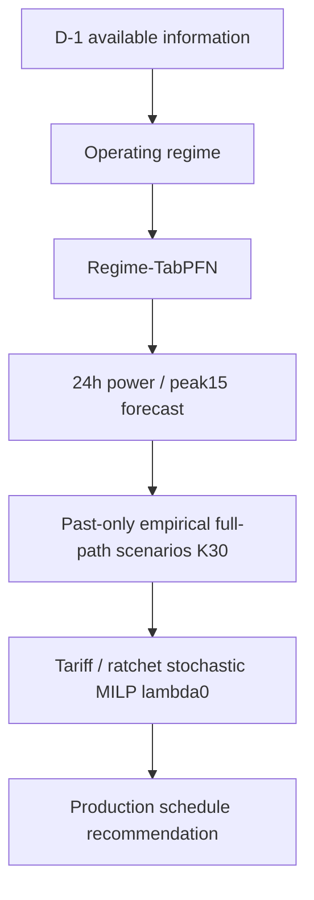

# Forecast Model Handoff

## 1. 목적과 전달 범위

오성민 forecasting/uncertainty layer를 배진형 decision/optimization layer와 연결하기 위한 문서다. 최종 설정은 TEST 전에 동결했으며 변경하지 않는다.



최종 forecasting name은 `regime_tabpfn_all`이다. 가동일은 TabPFN, 휴무일은 원본 과거 자료의 시간별 target median이다. `lambda=0`은 **uncertainty sampling의 parameter가 아니라 stochastic MILP의 CVaR risk 혼합 가중치**다. Full-path bootstrap과 K30은 uncertainty 설정이다.

## 2. 최종 모델 및 재현 설정

| 항목 | 동결 값 |
|---|---|
| Model | regime_tabpfn_all |
| Targets / horizon | power, peak15 / D-1 → 다음 날 00–23시 |
| Features | 기존46개, 순서까지 final_system_config.json에 보존 |
| Regime | plan_on_day.fillna(1)==1; 계획 누락은 보수적으로 가동 처리 |
| On / off | TabPFN / 원본 시간별 median(q=.5) |
| TabPFN package | 9.1.0 |
| Checkpoint | Prior-Labs/TabPFN-v2-reg / tabpfn-v2-regressor.ckpt |
| Revision | 4972a65a1b30806315c6f92499959ffbfc69a673 |
| SHA256 | 2ab5a07d5c41dfe6db9aa7ae106fc6de898326c2765be66505a07e2868c10736 |
| Inference setting | CPU4 threads, estimator4, median output, fit_with_cache, seed42 |
| Context | all eligible original operating history |
| Uncertainty | empirical full-path, K30 |
| Scenario seeds | 0/1/2; seed*100000+date.dayofyear |
| Decision | existing solve_stochastic; alpha.9/lambda0, delay<=2h, cap1, no extra starts |
| TEST adaptation | parameter refit / residual update / recalibration 없음 |

처음 weight 다운로드에는 인터넷이 필요하다. Offline은 위 SHA가 일치하는 파일을 준비하고 `KAMP_TABPFN_MODEL_PATH`를 지정한다. Weight 자체는 결과 ZIP에 포함하지 않았다. Prior Labs License1.1의 attribution 조건과 저장한 LICENSE 원문을 확인한다. 최신 package default 모델이나 v3 성능을 주장하지 않는다.

## 3. VALID 선정과 TEST 결과

Primary=(power F1 MAE+peak15 F1 MAE+power F2 MAE+peak15 F2 MAE)/4. Fold1=07/02–07/15, Fold2=07/16–08/15. 모든 선택은 VALID에서 끝냈다.

| Model | VALID primary | TEST power | TEST peak15 | TEST daily-max | TEST peak-hour |
|---|---:|---:|---:|---:|---:|
| regime_ens | 10.241 | 6.225 | 7.229 | 8.605 | 8.047 |
| Regime-TabPFN | 8.376 | 5.760 | 6.745 | 7.193 | 8.147 |

VALID18.21% 개선, 두 fold 모두 개선, original weekly rolling5주 중4주 개선/1주 동률이었다. Weighted ensemble의 추가 이득이 사실상 없어 단독 Regime-TabPFN을 골랐다. 일반 TabPFN은 regime 없이 Fold2에서 크게 악화했고 SARIMAX는 nonconverged baseline으로 보존했다.

TEST primary는6.727→6.252(7.05%)로 평균 개선 방향을 유지했지만 paired daily MAE difference=−.457kW,95%CI[−1.170,+.190]로0을 포함한다. 통계적으로 확정적인 개선이라고 표현하지 않는다. TEST를 보고 모델을 다시 선택하지 않았다.

## 4. 장점

- 기존 제조 regime 구조를 유지하면서 operating predictor만 pretrained TabPFN으로 바꾼 hybrid다.
- 작은 original operating sample 환경에서 tree champion보다 낮은 VALID 오류를 보였다. 다른 소표본 공장에도 강하다는 일반화는 하지 않는다.
- Forecast interface로 optimizer와 분리할 수 있으며 solver 코드를 model별로 복제하지 않는다.
- 24h residual path를 통째로 뽑아 시간 간 dependence를 보존한다. 이는 기존 empirical bootstrap도 갖고 있던 성질이다.

## 5. 단점 및 표현 주의

- CPU 비용이 크다. Phase2 VALID 전체 fit+predict430.5초 vs champion28.3초였다. 이 합계를 **순수 inference 속도비**로 표현하지 않는다. Cache도 사용하므로 target/sample/day별 inference 비용은 diagnostics로 확인한다. 실제 현장 latency 요구 충족은 별도 검증이 필요하다.
- Peak-hour MAE는8.047→8.147로 소폭 악화했다. 모든 세부 조건에서 우수하지 않다.
- TEST CI는0을 포함한다. 평균 개선 방향과 확정적 개선을 구분한다.
- 과거 pool에는 작은 초기 context와 큰 후기 context의 residual이 섞인다. 완전한 stationarity/exchangeability를 가정하기 어렵다. 사후 필터링/보정하지 않았다.
- Checkpoint/package/prior 및 기존 기상예보 대체 가정에 의존한다. Actual factory intervention 결과가 아니다.

## 6. Point / quantile interface

전달용 파일: `outputs/forecast_dist_regime_tabpfn_all.csv`.

```text
timestamp,target,point,q10,q50,q90,model
```

각 timestamp×target은 한 행이다. `point`가 최종 point prediction이다. Scenario가 있는 원본 가동일의 q10/q50/q90은 seed0 empirical scenario quantile이며 q50는 residual bias 때문에 point와 다를 수 있다. 휴무/정전 등 uncertainty 평가 대상이 아닌 날짜는 q10/q90을 비워두고 q50=point로 보존한다. 이 interval에 conformal guarantee를 주장하지 않는다.

기존 `src.decision_eval.load_external(index)`는 point가 있으면 point를 우선하고, 이전 q50-only 파일도 읽는다. 이는 **point/deterministic 연결**이다. 이 reader만 사용하면 stochastic joint scenarios가 전달되는 것은 아니다.

## 7. Stochastic interface: 반드시 full paths 전달

별도 파일: `outputs/final_system/handoff_joint_scenarios.csv`.

```text
date,timestamp,target,seed,scenario,hour,value,model
```

원본 유효 가동일25일에 대해 target별, seed별30×24 배열을 담는다. `scenario`는0–29, `hour`는0–23이다. 한 scenario의24개 hour를 함께 유지한다. 시간별 quantile을 독립적으로 조합하거나 q90만으로 joint path를 복원하면 안 된다. Power와 peak15는 같은 residual 날짜 정렬과 sample index를 공유한다.

Decision consumer 예시(저장된 forecast/scenario만 읽음):

```python
import pandas as pd
from src.stochastic_milp import solve_stochastic

paths = pd.read_csv("outputs/final_system/handoff_joint_scenarios.csv")
sub = paths[(paths.date == "2021-08-16") &
            (paths.target == "peak15") & (paths.seed == 0)]
peak_scen = sub.pivot(index="scenario", columns="hour", values="value")
peak_scen = peak_scen.reindex(index=range(30), columns=range(24)).to_numpy()
# d: 24h planned production, tariff bands/rates, past-only floor,
#    point power/peak15; coefs: pre-TEST surrogate fit.
plan, info = solve_stochastic(d, coefs, peak_scen,
                             alpha=.9, lam=0, return_info=True)
```

Point power는 기존 solver의 energy 중심값이다. Power scenarios는 확률 평가용이며, 현재 solver에 새로운 energy-risk objective를 추가하지 않았다.

## 8. Residual / mask / availability

선택 forecaster의 pool은 `outputs/final_system/residual_pool_regime_tabpfn_all.csv`다. 원본 가동일67일(01/28–08/14), target별67×24 벡터다. Record는 forecast_date/training_start_date/training_end_date/target/hour/actual/prediction/residual/operating/is_copy/plan_missing/origin_id/model을 포함한다.

Forecaster fitting은 Phase2 mask(Jan8 이후, origin보다 과거, non-outage/lag168 유효, plan_missing 포함)를 쓴다. TabPFN과 off median은 copy를 제외하고, regime_ens의 copy 저가중 정책은 비교 baseline에서 유지한다. Residual/decision은 원본·유효 계획·가동·완전24h·non-outage 날짜로 한정한다. Warm-up은 원본 학습일14일, origin cadence는14calendar일이다.

`data_eligibility.csv`는 stage/date/eligible/excluded_reason을 저장한다. training_end_date<forecast_date 위반0건이다. TEST actual은 fitting/pool에 들어가지 않는다. D-1 TEST observations의 lag/floor 사용은 기존 문제 정의에서 허용하지만 model/pool 갱신은 아니다.

기존 regime_ens residual을 Regime-TabPFN에 쓰거나 두 model의 pool을 섞지 않는다. 다른 과거 날짜를 분석할 때도 forecast_date 이전 residual만 사용한다. 이 handoff의 TEST용 pool을7/19처럼 더 이른 날짜로 소급해 사용하면 안 된다.

## 9. Decision 결과와 deterministic reference

| System | Saving/day | Regret/day |
|---|---:|---:|
| regime_ens + empirical stochastic | 9,323원 | 782원 |
| Regime-TabPFN + empirical stochastic | 9,539원 | 567원 |
| Regime-TabPFN + point deterministic reference | 10,106원 | 0원 |

Stochastic B−A saving=+216원/일,95%CI[−525,+1,081]이다. 평균은 개선 방향이지만 경제적 개선을 확정할 수 없다. Actual baseline + common linear surrogate change의 counterfactual estimate이며 actual intervention이 아니다.

TEST floor는 모든 decision일222kW, 초과 사건0/25일이다. Ratchet saving은0이며 TOU saving만 발생했다. 기존 optimizer의 forecast power는 계획에 대한 상수항이므로 power MAE 개선 자체가 TOU 계획을 바꾸지 않는다. 주요 forecast-to-decision 경로는 peak15 scenario/ratchet risk다.

이 무사건 기간에서는 stochastic의 보수성이 기회비용을 만들었고 deterministic reference는 oracle과 같은 saving을 기록했다. TEST를 보고 policy를 재선택하지 않았다. 일반적으로 deterministic이 우수하다는 결론도 내리지 않는다.

## 10. 7/19 VALID case의 범위

7/19은 Phase1의 기존 regime_ens forecaster로 평가한 별도 VALID 사례다. Rare ratchet avoidance의 큰 모델링 이익을 보여주지만 **새 Regime-TabPFN의 rare-event 개선 증거는 아니다**. Stochastic이 deterministic에 반드시 이긴다는 비교 결론으로 바꾸지 않는다. 이번 TEST에는 사건이 없으므로 이 부분을 검증할 수 없다.

## 11. 통합 시 금지사항

1. workers / current-future target-derived features를 다시 넣지 않는다.
2. TEST actual을 residual pool/fitting/calibration에 쓰지 않는다.
3. Forecast 날짜 이후 residual을 과거 forecast에 쓰지 않는다.
4. 46features/순서, regime/context/weight를 바꾸지 않는다.
5. K30/lambda0/seed/constraints/tariff/threshold를 결과를 보고 재조정하지 않는다.
6. Forecaster별 residual을 섞지 않는다.
7. Surrogate counterfactual을 actual intervention으로 표현하지 않는다.

## 12. 통합 확인

- [x] Regime-TabPFN dependency / pinned checkpoint / 46feature schema
- [x] Frozen regime/copy/plan_missing rules
- [x] 새67일past-only pool / leakage0
- [x] K30 / seeds0,1,2 / lambda0
- [x] Decision 권고안175개 optimal(2stochastic×75 + deterministic25)
- [x] pytest35 passed / old champion preserved
- [x] Pre-TEST config/code commit8e9a7ac, audit17checks pass
- [x] TEST completed once; no tuning/online adaptation
- [ ] 배진형 트랙 consumer에서 timestamp/target/seed/path alignment 확인
- [ ] 실제 운영일의 D-1 plan/weather availability와 CPU latency 검증

Point CSV와 full scenario CSV는 **저장된 평가의 handoff**다. 새 training/forecast/optimization/TEST evaluation을 실행하지 않았다. Scenario 재현값은 기존 seed0 quantile export와 일치하는지 확인하고 handoff_export_manifest.json에 결과를 남겼다.

## 13. 코드 / 재현 / 최종 구성

Model factory는 `src.forecast_adapters.make_forecaster("regime_tabpfn_all")`, canonical masks/past-only generator는 `src/final_system.py`다. Frozen config는 `experiments/final_system_config.json`, end-to-end CLI는 `experiments/final_system.py`다. Reader/optimizer는 `src/decision_eval.py` / `src/stochastic_milp.py`다. 상세 재현은 `docs/PHASE3_FINAL_SYSTEM.md`, final metrics/한계는 `docs/REPORT_DRAFT.md`를 따른다.

새 환경에서 repository root의 `seongmin` 브랜치로 실행한다(Python3.12 / Windows CPU). 기존 평가를 다시 실행하는 것이 아니라, 별도 새 환경에서 동결된 설정을 재현하는 명령이다.

```powershell
python -m venv .venv
.venv/Scripts/python.exe -m pip install -r requirements-phase2.txt
.venv/Scripts/python.exe -m pytest -q
# 기존 final_system_config.json을 유지한다. freeze를 다시 실행하지 않는다.
.venv/Scripts/python.exe -m experiments.final_system --stage prepare
.venv/Scripts/python.exe -m experiments.final_system --stage audit
# 코드/config가 commit되어 있고 working tree가 clean이어야 한다.
.venv/Scripts/python.exe -m experiments.final_system --stage test
```

Offline 실행 시 pinned checkpoint를 준비하고 `$env:KAMP_TABPFN_MODEL_PATH`에 경로를 지정한다. 최초 weight 확보에는 인터넷이 필요하며 revision/SHA256은 위 동결 설정과 일치해야 한다. `prepare`가 새 forecaster의 past-only residual을 생성하고, `test`가 empirical K30 scenario와 기존 stochastic MILP를 연결한다. 기존 `test_execution.json`이 있는 output directory에서는 TEST 재실행을 거부한다. 저장된 결과의 표만 다시 만들려면 `--stage summarize`를 사용한다.

`outputs/`와 checkpoint는 Git 추적 대상이 아니다. GitHub에는 코드·동결 설정·결과 문서를 제공하며, 위 명령으로 `outputs/final_system/`의 residual, forecast distribution, probabilistic/decision metrics와 production recommendations를 생성한다. 기본 distribution 파일은 `test_forecast_distributions.csv`다. 권장 이름 `forecast_dist_regime_tabpfn_all.csv`와 full scenario CSV는 저장된 결과로부터 별도로 내보낸 handoff 파일이므로 GitHub clone에 자동 포함되지 않는다. Quantile CSV만으로 24시간 joint path를 복원할 수 없으므로 consumer는 residual pool과 동일 seed 규칙 또는 내보낸 full scenario CSV를 사용해야 한다.

최종 구성은 Regime-TabPFN + empirical joint residual uncertainty + tariff/ratchet stochastic MILP다. VALID에서 선택한 구성을 TEST 결과와 관계없이 유지한다. 최종 결과 문서와 handoff는 `seongmin`에 commit/push하며 main은 수정하거나 merge하지 않는다.
