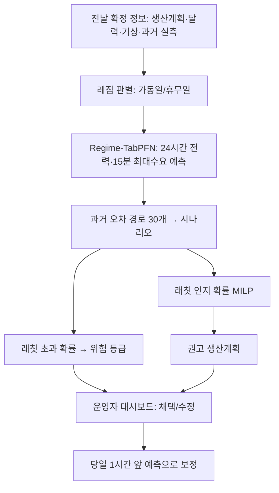

# 제6회 K-인공지능 제조데이터 분석 경진대회 결과 보고서 (초안)

> 초안 작성 2026-09-30, 통합본 2026-10-04(배진형 파이프라인 + 오성민 Regime-TabPFN·불확실성 결합). 대회 양식(휴먼명조 14, 줄간격 160)으로 옮기기 전 원고.
> 블라인드 평가: 소속·학교명·로고·저장소 주소·계정명은 넣지 않는다(성명·팀명만).
> 그림 경로는 `python run_all.py`(`outputs/`)와 `python -m experiments.final_system`(`outputs/final_system/`)이 생성하는 파일이다.
> `【확인】` 표시는 제출 전에 채우거나 다시 계산해야 하는 곳이다.

---

## 표지

| 항목 | 내용 |
|---|---|
| 부문 | 일반국민/대학(원)생 |
| 프로젝트명 | 생산계획 기반 공장 전력 예측과 래칫 인지 피크 관리 |
| 팀명 | (팀명) |
| 선택 문제 | ⑤ 제조 생산데이터 기반 전력사용량 예측 및 최대피크 위험조건 분석 |

**내용 요약**

- 데이터 진단에서 **257일 중 115일이 증강 복제일**이고, `공장인원`이 전력으로 역산되는 **타깃 누수 열**임을 찾아 제거했다. 무작위 교차검증은 오차를 약 32% 과소평가하므로 시간순 검증만 사용했다.
- 예측 모델의 뼈대는 **생산계획으로 가동일/휴무일을 먼저 가르는 레짐 전환 구조**다. 휴무일은 시간대별 기저부하, 가동일은 학습 모델이 맡는다. 가동일 모델로 LightGBM·ExtraTrees 앙상블과 사전학습 표 모델 **TabPFN**을 같은 조건에서 비교해, 검증 점수가 가장 낮은 **Regime-TabPFN**을 테스트 전에 최종 모델로 정했다(검증 MAE 10.24 → 8.38, −18%). 테스트 전력 MAE는 5.76kW로 비교 모델 중 가장 낮다. 레짐 구조 없이 TabPFN만 쓰면 검증 MAE가 18.32로 무너져, 성능의 핵심은 제조 지식(레짐)과 사전학습 모델의 결합임을 보였다.
- 피크는 **가동일의 주간조 시간**에 발생하고 기온과는 무관했다(상관 0.02). 한전 요금 구조를 반영하면 가장 큰 피크 시간(08시)은 경부하라 기본요금과 무관하고, 7월 한 번의 피크(7/19 11시 222kW)가 **래칫**으로 향후 12개월 기본요금을 결정한다(약 163만 원).
- 과거 예측 오차 경로로 만든 30개 시나리오를 함께 고려하는 **래칫 인지 확률 MILP**로 생산을 최대 2시간 이동하는 계획을 세운다. 7월(래칫 갱신 위험)에는 7/19 래칫 갱신을 피해 하루 평균 11.2만 원(완전 예측의 96%)을, 래칫이 이미 고정된 테스트 구간에서는 하루 약 9.2~9.5천 원의 전력량요금을 줄인다. 강화학습·유전 알고리즘·타부 탐색도 같은 조건에서 비교했으나 MILP가 모든 조건에서 우세했다.
- 운영안: **전날 저녁 위험도 경보 + 권고 생산계획 → 당일 1시간 앞 예측으로 보정**. 요금 선택(Ⅱ가 최적), 소형 ESS(22kW/11kWh로 연 약 220만 원 기본요금 절감 가능) 판단 근거를 함께 제시한다.

---

## 제1장. 데이터 이해 및 진단 〔15점〕

### 1.1 데이터 개요
- 기간·단위: 2021-01-01 ~ 09-14, 1시간 단위 6,168행(257일). 각 행에 15분 단위 수요 4개(15·30·45·60분)와 시간 평균이 있다. 15분 값은 그 15분의 평균 수요(kW)로 본다(가정).
- 변수: 생산량, 공장인원, 인건비 배수(1.0/1.5), 전기요금(계절), 기온·풍속·습도·강수량, 날짜·요일·일·월.
- 변수 정의표(원천 6,168행 기준. 단위는 제공 자료에 명시가 없어 값의 구조로 추정했다)

| 원천 변수 | 의미(해석) | 단위(추정) | 범위 | 결측·이상 | 사용 |
|---|---|---|---|---|---|
| 날짜, 시간 | 측정 일자, 일내 시각(0~23) | — | 2021-01-01~09-14 | `시간` 48행이 전력값으로 덮임(최대 188) | 순번으로 복원 |
| 15분·30분·45분·60분 | 그 시간 안 15분 구간별 평균 수요 | kW | 0~222 | 정전 17시간 0 | **타깃** `peak15` = 4개 중 최대 |
| 평균 | 15분 값 4개의 평균(반올림, 전 행 일치) | kW | 0~208 | — | **타깃** `power` |
| 생산량 | 그 시간 생산 계획(실적)량 | 단위 미상(수량) | 0~9,830, 가동 시간 중앙값 488 | 7/13·15 0으로 지워짐 | 전날 확정 계획으로 가정, 레짐 판별 |
| 공장인원 | 생산량 ÷ (15분 수요 4개 합)으로 계산된 값 | — | 0~48.4 | 결측 17 | **타깃 누수 → 제거** |
| 인건비 | 시간대 인건비 배수 | 배 | 1.0(09~17시)·1.5(18~08시) | — | 피처, 4.4절 시나리오 |
| 전기요금(계절) | 계절 최대부하 단가 + 0.5로 추정 | 원/kWh | 109.8·167.2·191.6 | 계절 배정이 한전 기준과 다름 | 계절 지시값 |
| 기온·풍속·습도·강수량 | 시간 기상 | ℃·m/s·%·mm | −12~33.4, 0~7.6, 8~98, 0~122.4 | 풍속 3·강수량 1 결측 | 선형보간, 예보 대체 가정 |
| day·d·m | 요일(1=월~7=일)·일·월 | — | — | — | 달력 피처 |

### 1.2 데이터가 나타내는 공정 상태
- **생산계획 = 가동 여부**: 생산량이 있는 날 159일은 예외 없이 가동(평균전력 70 이상)했다. 계획이 없는 날은 기저부하(약 21~23kW)이거나 토요일 부분 가동(약 45kW)이다. 예측 모델의 레짐 전환 구조는 이 관찰에서 출발한다.
- **주간조가 부하를 만든다**: 가동일 평균 15분 최대수요는 08~11시·13~16시에 150 안팎, 12시(점심) 107, 19시 이후 100 안팎이다(그림 pc1).
- **교대 구조**: 인건비는 09~17시 1.0배, 18~08시 1.5배로 주간조/야간조가 구분된다. 원본 가동일에서 생산량의 **38.5%가 야간조(18~08시)**에 나오지만 평균 전력은 야간 97kW, 주간 132kW다. 같은 생산이라도 주간에 전력이 훨씬 많이 드는 것은 주간에만 도는 설비(공조·조명·보조설비 등)가 얹히기 때문으로 해석한다(업종·설비 정보는 제공되지 않아 추정).

### 1.3 품질 진단과 처리

| 발견 | 근거 | 처리 |
|---|---|---|
| **증강 복제일** | 257일 중 **115일**이 앞선 날짜와 15분 수요 96값이 완전히 같다. 1~6월 대부분(1·4월 날짜가 원본), 7월 이후는 7/30(= 7/28 사본) 하나뿐. 일요일에 평일 곡선이 복사된 날도 있다 | 학습: 앙상블은 복제일을 낮은 가중치(검증으로 결정)로, TabPFN은 원본만 사용. 모델 비교 점수는 기존 평가 기준과 같게 복제일을 포함하고 원본만의 점수를 보조로 확인. 오차 시나리오·의사결정 평가는 원본만 |
| **타깃 누수 열** | `공장인원 = 생산량 ÷ (그 시간 15분 수요 4개의 합)`이 6,151행 전부에서 오차 4.9×10⁻⁹로 성립. 생산량과 인원을 알면 그 시간 전력이 역산된다. `평균`도 15분 값 평균(반올림)과 전 행 일치 | 공장인원과 파생 피처를 모두 제거. 제거 전 성능은 부풀려져 있었다(검증 MAE 8.6 → 제거 후 12.6, 레짐 LightGBM) |
| **시간 컬럼 손상** | 7/13·7/15 48행: `시간` 값이 전력값으로 덮이고(상관 0.91) 생산량·인원도 0으로 지워짐 | 모든 날짜가 정확히 24행이고 정상 행에서 시간 = 일내 순번이 100% 일치 → 순번으로 복원, 생산계획은 결측 처리(예측 시에는 보수적으로 가동일로 간주) |
| 정전·전면휴무 | 8/28~29 전력 0 (17시간) | 학습·평가 제외 |
| 하계휴가 | 7/31~8/8 평일 포함 9일 기저부하 | 레짐 구조로 대응(검증 구간에 포함 → 운전 상태 전환 평가) |
| 결측 | 풍속 3, 강수량 1, 공장인원 17 | 선형보간 / 공장인원은 사용 안 함 |
| 요금 컬럼 | `전기요금(계절)` 109.8·167.2·191.6은 각각 어떤 계절 최대부하 단가 + 0.5와 맞지만, 계절 배정이 한전 기준과 어긋남(1~2월 = 봄·가을 값, 3~5·9월 = 겨울 값) | 피처로는 계절 지시값으로만, 비용 계산은 한전 요금표로 직접(4장) |
| 기상 | 일 최대수요와 일 최고기온 상관 0.02 | 기상 파생 피처는 검증에서 기각 |

### 1.4 검증 전략
- **시간순 분할**: 학습 1/8~7/1 · 검증 2개 구간(fold1 7/2~7/15, fold2 7/16~8/15, 하계휴가 포함) · 테스트 8/16~9/14. 각 검증 구간은 그 이전 데이터로만 학습한다. 모델·하이퍼파라미터·앙상블 가중치·임계값은 모두 검증 구간에서 결정했고, 최종 모델은 설정을 동결한 뒤 테스트에서 한 번 평가했다.
- **테스트 격리**: 테스트 기간은 결측 보간·피처 생성·복제일 탐지 **이전에** 잘라내, 테스트 값이 학습용 전처리에 영향을 주지 않게 했다. 테스트 실행 전 설정과 코드를 커밋하고, 실행 기록 파일이 있으면 재실행을 거부하도록 해 "결과를 보고 다시 고르기"를 막았다(6장).
- **복제일 누수 시연**: 같은 학습 기간에서 교차검증 방식만 바꾸면

| 방식 | MAE | 복제일 | 원본일 |
|---|---|---|---|
| 무작위 시간 단위 5-fold | 11.24 | 8.68 | 15.06 |
| 날짜 단위 묶음 | 15.14 | 10.33 | 22.28 |
| 동일 곡선(복제 그룹) 묶음 | **16.43** | 12.09 | 22.89 |

무작위 교차검증은 오차를 **약 32% 과소평가**한다(복제일의 원본이 학습 fold에 들어감).
- **누수 감사 자동화**(6장): 원자료 항등식, 금지 열 부재, 미래 교란 검사(D일 실측을 바꿔도 D일 피처 불변), 시차 확인, 평가일이 학습 날짜의 사본이 아닌지, 테스트 이전 데이터만으로 학습하는지 등을 자동 테스트로 검사한다.

---

## 제2장. AI 예측모델 개발 및 성능평가 〔40점〕

### 2.1 예측 과제 정의 ("향후 지정된 시간구간")
- **하루 전 예측**: D-1일 자정에 D일 00~23시의 시간별 평균전력과 **15분 최대수요**(한전 최대수요전력 산정 단위)를 예측한다. 생산계획을 조정할 수 있는 마지막 시점이 전날이기 때문이다.
- 입력: 24시간 이상 지난 실측 전력, 당일 생산계획(전날 확정 가정), 달력·공휴일, 기상(예보로 대체 가능 가정). 46개 피처.
- **예측 구간을 바꿔도 되나?**(그림 horizon_curve, 레짐 앙상블 기준) H시간 앞 예측을 따로 학습해 비교했다.

| 전력 MAE | 1시간 앞 | 3 | 6 | 12 | 24시간 앞 |
|---|---|---|---|---|---|
| 테스트(평상 운전) | 6.29 | 6.01 | 6.62 | 6.62 | 6.54 |
| 검증(휴무·재가동 포함) | 6.69 | 8.64 | 10.12 | 11.23 | 11.19 |
| 지속 예측(H시간 전 값), 테스트 | 15.99 | 23.75 | 33.87 | 51.17 | 36.66 |

평상시에는 하루 전 예측이 1시간 앞 예측과 거의 같고(생산계획이 부하의 대부분을 설명), 운전 상태 전환기에는 당일 최신 실측이 오차를 40% 줄인다. → **전날 계획 + 당일 1시간 앞 보정**의 2단계 운영(4장).

### 2.2 비교 모델

| 모델 | 설명 |
|---|---|
| 전일 같은 시각 | 베이스라인 1 |
| 전주 같은 시각 | 베이스라인 2 |
| Ridge | 선형 회귀 |
| SARIMAX | 전통 시계열. (1,0,0)×(1,0,0,24) + 생산계획·달력·기상 외생변수. 하루 24시간을 한 번에 예측한 뒤에만 그날 실측으로 상태 갱신 |
| LightGBM 단일 | 모든 날을 하나의 모델로 |
| TabPFN 단일 | 사전학습 표 데이터 모델(TabPFN-v2 공개 가중치). 모든 날을 하나의 모델로 |
| 레짐 전환 LightGBM | 생산계획으로 가동일/휴무일을 먼저 판별. 가동일 = LightGBM(L1), 휴무일 = 시간대별 중앙값 기저부하(원본 휴무일 13일뿐이라 학습형 모델이 과적합) |
| 레짐 전환 앙상블 | 가동일 타깃을 "직전 가동일 같은 시각 값 대비 잔차"로 학습, 복제일 저가중, LightGBM(L1, 3시드) 0.3 + ExtraTrees 0.7. 하이퍼파라미터·가중치는 두 검증 fold로만 결정(Optuna) |
| **Regime-TabPFN (최종)** | 같은 레짐 구조에서 가동일 모델만 TabPFN으로 교체. 원본 가동일 전체 이력을 문맥(context)으로 사용, 휴무일은 동일한 시간대별 중앙값 |

피처(모든 학습형 모델 공통 46개): 달력·공휴일, 시차(24·48·168시간), 직전 가동일 같은 시각 값, 생산계획(시간·일 생산량, ±1시간 평균, 가동 시작·종료 시각, 야간조, 운전 레짐), 기상.

**TabPFN을 넣은 이유**: 원본 가동일 학습 표본이 1,224~1,512시간 수준으로 작다. TabPFN은 대량의 합성 표 데이터로 사전학습되어 작은 표본에서 별도 튜닝 없이 강한 회귀 모델로 알려져 있어, 튜닝을 많이 한 트리 앙상블과 비교할 가치가 있었다. 재현을 위해 모델 가중치의 버전과 해시(SHA256)를 고정했다.

### 2.3 동일 조건 비교와 최종 모델 선정

**선정 기준(테스트 전 확정)**: 검증 점수 = 두 검증 fold × 두 타깃(시간 평균전력, 15분 최대수요) MAE의 평균. 채택 조건은 기존 최선 모델(레짐 앙상블)보다 0.05kW 이상 좋고, 어느 fold에서도 0.2kW 넘게 나빠지지 않을 것.

| 모델 | 검증 점수 | 테스트 전력 | 테스트 15분최대 | 테스트 일최대 |
|---|---|---|---|---|
| 전일 같은 시각 | 37.38 | 36.66 | 40.04 | 51.17 |
| 전주 같은 시각 | 27.55 | 8.26 | 9.73 | 10.07 |
| Ridge | 34.92 | 14.54 | 15.57 | 16.43 |
| SARIMAX | 32.88 | — | — | — |
| LightGBM 단일 | 23.30 | 6.84 | 7.38 | **6.01** |
| TabPFN 단일 | 18.32 | — | — | — |
| 레짐 전환 LightGBM | 14.47 | 6.65 | 7.58 | 6.89 |
| 레짐 전환 앙상블 | 10.24 | 6.23 | 7.23 | 8.60 |
| **Regime-TabPFN (최종)** | **8.38** | **5.76** | **6.75** | 7.19 |

- 테스트 "—"는 검증에서 탈락해 테스트를 돌리지 않은 모델이다. SARIMAX는 네 번의 적합 모두 50회 반복 안에 수렴하지 않아 베이스라인으로만 남겼다.
- Regime-TabPFN은 두 fold 모두에서 개선했다(fold1 10.40 → 9.40, fold2 10.08 → 7.35). 검증 이후 주 단위 재학습 평가(원본 데이터, 5주)에서도 4주 개선·1주 동률(평균 −3.59kW)로 사전 기준을 통과했다.
- 레짐 앙상블과 TabPFN을 섞는 앙상블도 검토했으나 추가 이득이 0.008kW로 복잡도 기준(0.1kW)에 못 미쳐 단독 모델을 택했다. TabPFN의 최근 28일·14일만 문맥으로 쓰는 변형은 표본이 너무 적어 크게 나빠졌다(24.3).
- 테스트에서도 전력·15분최대 모두 Regime-TabPFN이 가장 낮다(검증·테스트 점수 기준 개선 −18% / −7%). 일최대 수요 MAE만은 단일 LightGBM이 여전히 가장 낮다 — 일 단위 경보에는 보완적으로 쓸 수 있다.

(그림 fig3 테스트 예측, `final_system/fig_test_daily_errors.png` 날짜별 오차)

**레짐 구조가 성능의 핵심이다(검증 점수)**

| 가동일 모델 | 레짐 없음 | 레짐 전환 | 개선 |
|---|---|---|---|
| LightGBM | 23.30 | 14.47 | −38% |
| TabPFN | 18.32 | **8.38** | −54% |

TabPFN만 쓰면 하계휴가가 있는 fold2에서 휴무 평일을 가동일처럼 예측해 실패한다. 생산계획으로 운전 상태를 먼저 나누고 가동일만 TabPFN에 맡길 때 비로소 가장 좋은 모델이 된다. 즉 **제조 지식(레짐)과 사전학습 모델이 서로를 보완한다**.

**레짐 앙상블까지의 개선 과정(검증 fold2 전력 MAE)**

| 구성 | MAE |
|---|---|
| 생산계획 없음 | 34.60 |
| + 생산계획 (단일 LightGBM) | 29.87 |
| + 레짐 전환 | 12.60 |
| + 잔차 학습·복제일 저가중·앙상블 | 9.77 |

**차이가 우연이 아닌가(날짜 단위 짝지은 부트스트랩 5,000회, 95% CI)**

| 비교 | 구간 | 차이(kW) | 95% CI |
|---|---|---|---|
| Regime-TabPFN − 레짐 앙상블 | 검증 전체 | — | [−3.75, −0.30] (유의) |
| | 검증 가동일 | — | [−5.06, −0.86] (유의) |
| | 테스트 전체 | −0.46 | [−1.17, +0.19] |
| | 테스트 가동일 | −0.53 | [−1.32, +0.23] |
| | 테스트 피크 시간대(08~11, 13~16시) | +0.10 | [−1.10, +1.29] |
| 레짐 앙상블 − 단일 LightGBM | 검증 | −20.1 | [−32.7, −9.5] (유의) |
| 레짐 앙상블 − 전주 같은 시각 | 테스트 | −2.0 | [−3.2, −0.8] (유의) |

- 검증에서는 개선이 유의했고, 테스트에서도 평균은 같은 방향(−7%)이지만 신뢰구간이 0을 포함한다. 테스트 30일은 휴무·재가동이 없는 평상 운전이고, 평상시 오차는 이미 노이즈 바닥에 가깝기 때문이다(아래). 테스트 결과로 모델을 다시 고르지 않았다.
- 피크 시간대만 보면 테스트에서 개선이 없다(08~11·13~16시 시간 MAE 8.05 → 8.15). 3장의 실패 조건과 같은 곳이다.
- **예측 오차의 바닥**: 1시간 전 실측까지 입력해도 테스트 MAE 6.16(레짐 앙상블), 한 시간 안 15분 값 편차 평균 6.1 → 평상시 오차는 거의 노이즈 수준이고, 남은 개선 여지는 운전 상태 전환에 있다. Regime-TabPFN의 검증 이득이 휴가 주간이 있는 fold2와 주간 재학습 1·5주차(−6.0, −10.3)에 몰린 것도 같은 이유다.

### 2.4 피크 위험 판정(분류 관점, F1)
평가표의 "이상 확률·F1"을 "목표수요(15분 수요 ≥ 190kW, 원본 기간 상위 5%) 초과"로 대응시켰다. 판정 임계값은 검증 구간에서만 결정. 임계값은 검증 45일(7/2~8/15)에서 F1이 최대가 되는 값으로 정했다.

| 일 단위 초과일 판정(테스트 30일 중 14일) | F1 | 재현율 | PR-AUC |
|---|---|---|---|
| 규칙: 평일 가동 주간이면 경보 | 0.743 | 0.93 | 0.61 |
| 전일 실측 | 0.316 | 0.21 | 0.49 |
| **예측 일최대(레짐 앙상블, 임계값 120)** | **0.778** | **1.00** | **0.73** |
| **예측 일최대(Regime-TabPFN, 임계값 152)** | **0.778** | **1.00** | 0.64 |
| 전용 분류기(등위 보정 확률) | 0.692 | 0.64 | 0.65 |

- 두 모델 모두 검증에서 정한 임계값이 190보다 훨씬 낮아(120·152), 사실상 "가동 평일이면 경보"가 되어 테스트 경보 22일 중 14일 적중(정밀도 0.64)으로 같은 결과다. 임계값을 190 그대로 쓰면 TabPFN이 F1 0.42(재현율 0.36)로 앙상블(0.13)보다 낫지만 여전히 놓치는 날이 많다 — 두 모델 모두 피크를 과소예측하기 때문(2.5·3.3절). 일 순위(PR-AUC)는 앙상블이 더 좋다.
- 시간 단위 판정은 F1 0.38(정밀도 0.25)이 최선. 평일 일최대가 모두 183~204kW에 몰려 190이 분포 한가운데 걸리기 때문(3장).

### 2.5 예측 분포(불확실성) 평가
피크 관리에는 점 예측보다 "얼마나 넘을 수 있나"가 필요하다. 각 예측 모델에 대해, 테스트 이전의 원본 가동일마다 **그날 이전 데이터로만 학습한 모델의 24시간 오차 경로**를 모아(67일) 오차 풀을 만들고, 예측값에 오차 경로를 통째로 30개 더해 시나리오를 만든다. 시간 간 오차 상관이 보존되므로 "하루 중 어느 시간이 최대가 될지"까지 시나리오에 반영된다. 공분산·주성분 기반 대안도 검증에서 비교했으나 이득이 없어 이 단순한 방식을 유지했다.

| 테스트 25일(원본 가동일) | CRPS ↓ | 전력 CRPS ↓ | 에너지 점수 ↓ | 80% 구간 포함률 | 구간 폭 | 목표수요 초과 Brier ↓ | 래칫 초과 Brier ↓ |
|---|---|---|---|---|---|---|---|
| 레짐 앙상블 + 오차 시나리오 | 6.99 | 6.34 | 43.70 | 0.95 | 55.0 | **0.060** | 0.017 |
| **Regime-TabPFN + 오차 시나리오** | **6.66** | **5.94** | **42.81** | 0.87 | **51.5** | 0.071 | **0.005** |

- 분포 정확도(CRPS·에너지 점수)는 Regime-TabPFN이 더 좋고 구간도 더 좁다. 래칫 초과 Brier가 낮은 것은 테스트에 래칫 초과일이 없으므로 "오경보 확률을 덜 낸다"는 뜻이며, 드문 사건을 잘 잡는다는 증거는 아니다.
- 80% 구간의 실제 포함률이 0.87·0.95로 명목보다 넓다(보수적). 추가 보정은 하지 않았고, 분위수에 보정 보장이 있다고 주장하지 않는다.
- TabPFN의 과거 오차는 평균 −6.8kW로 과소예측 쪽으로 치우쳐 있다(앙상블 −1.9). 피크 시간대 과소예측(3.3절)과 같은 현상이다.

---

## 제3장. 영향요인 및 오류분석 〔15점〕

### 3.1 피크(최대전력)가 발생하는 조건
(그림 pc1 시간대별, pc2 요일×월, pc3 일 생산시간, pc4 시간 내 15분)
- **가동일에 난다**: 일 생산시간 13시간 이상인 날의 일최대 평균 189~191kW, 12시간 이하 126~139kW. 일최대와의 상관: 일 생산량 0.68, 일 생산시간 0.66, 일 최고기온 0.02.
- **주간조 시간에 난다**: 가동일 피크(≥190) 확률 08시 33%, 11시 27%, 13·14시 22%, 12시(점심) 0%, 19시 이후 거의 0.
- 가동 첫 시간(5.2%)보다 **생산이 이어지는 시간(9.4%)**이 더 위험 — 야간 부하 위에 주간 설비가 얹히는 구조(08시 안에서 15분 값 134 → 150kW).
- 피크 시간 안에서는 **뒤쪽 15분**(45·60분)에 최대가 찍힌다(181건 중 122건).
- 요일: 목요일 일최대 평균 195(최고), 토요일 126. 월: 7월·1월 높음.
- 출제 배경 요인과의 대응: 설비 동시 가동 → 주간 시간대·시간 내 후반 상승, 생산량 변화 → 일 생산시간·생산량, 교대 → 인건비 1.5 구간과 야간 부하, 계절 → 7월·1월. 제품 전환은 데이터에 없어 분석 불가(한계).
- **요금 관점**: 15분 수요 190 이상 시간의 **29%(73/253)는 요금상 경부하(08시)**라 기본요금과 무관. 기본요금에 반영되는 피크는 10~11시·13~16시.

### 3.2 주요 영향변수와 상호작용
SHAP은 트리 모델에서 정확한 분해가 가능해 레짐 앙상블로 계산했다. 두 모델은 같은 46개 피처와 같은 레짐 구조를 쓰고, 검증 오차의 상관이 0.72~0.82로 높다. `【확인】 Regime-TabPFN 순열 중요도로 상위 변수 순위가 같은지 교차 확인`

(그림 fig5 SHAP 중요도, fig8 요약, fig9 의존도, fig10 상호작용 — 가동일 15분 최대수요, 오프셋 포함 정확 분해)
- 상위: 직전 가동일 같은 시각 피크·전력 → 가동 종료 이후 여부 → 전주 같은 시각 → 생산량(±1시간 평균) → 휴무 여부 → 가동 종료 시각.
- 상호작용 상위: 휴무 × 가동 종료 이후(3.80), 전주 피크 × 직전 가동일 전력(1.34), 시각 × 직전 가동일 피크(1.11), 월 × 생산량(0.98).
- **생산량 자체는 약한 레버**: DiCE 반사실로 예측 ≥ 185kW인 테스트 4시간을 목표수요 아래로 내리려면 해당 시간 생산을 중앙값 90% 줄여야 한다. 전력은 생산량보다 **가동 여부와 가동 시각**에 반응한다(4장 설계 근거).

### 3.3 잘 작동하는 조건과 실패하는 조건 (전력 MAE)
검증은 fold2(7/16~8/15, 하계휴가 포함), 테스트는 8/16~9/14. 두 모델을 같은 시간에 대해 집계했다.

| 조건 | 검증 앙상블 | 검증 Regime-TabPFN | 테스트 앙상블 | 테스트 Regime-TabPFN | 해석 |
|---|---|---|---|---|---|
| 휴무일 | 1.72 | 1.72 | 0.96 | 0.96 | 레짐 구조로 거의 완벽(두 모델 같은 기저부하 규칙) |
| 평상 가동일 | 8.40 | **6.74** | 6.38 | **5.90** | 노이즈 수준까지 낮아짐 |
| **3일 이상 휴무 후 재가동일** | **24.41** | **12.24** | — | — | 앙상블 최대 실패 조건(단일 LightGBM 22.8)을 TabPFN이 절반으로 줄임. 테스트에는 해당일 없음 |
| 휴무 전날 | 11.00 | **4.96** | 5.15 | 4.85 | |
| **최대부하 요금 시간대** | 15.45 | 11.87 | 8.79 | 8.61 | 두 모델 모두 오차 최대. 요금상 가장 비싼 시간 |
| 주간 피크대(08~11, 13~16시) | 12.67 | 9.39 | 7.64 | 7.82 | 검증에서는 개선, **테스트(평상 운전)에서는 개선 없음**. 과소예측 편향(2.5절) |
| 그 외 시간 | 8.32 | 5.60 | 5.51 | **4.73** | |
| 생산량 501~1500 | 19.08 | 15.43 | 8.54 | 8.29 | 중간 생산량에서 오차 큼 |
| 월요일 | 12.22 | 8.81 | 9.70 | **8.05** | 주말 후 재기동. 두 구간 모두 크게 개선 |

- **잘 작동하는 조건**: 휴무일(레짐 규칙), 평상 가동일, 그리고 Regime-TabPFN에서는 **재가동일·휴무 전날·월요일 같은 운전 상태 전환**. 검증에서 3일+ 휴무 후 재가동일 오차가 24.4 → 12.2로 절반이 됐고, 주간 재학습 평가의 1·5주차(18.3 → 12.3, 18.5 → 8.2)도 같은 이유다. 작은 표본에서 사전학습 모델이 드문 상황에 덜 무너진다.
- **실패하는 조건**: **최대부하 시간과 주간 피크대**. 두 모델 모두 오차가 가장 크고, 평상 운전인 테스트에서는 TabPFN도 개선하지 못했다(7.64 → 7.82). 요금·래칫에 가장 중요한 시간이 가장 예측하기 어렵다는 것이 핵심 한계이며, 그래서 점 예측 대신 오차 시나리오로 피크 위험을 다루는 확률 MILP(4장)가 필요하다.
- 원본 학습 데이터가 적은 시점(7/12 주)에는 롤링 평가에서 레짐 앙상블이 전주 값에 졌다.

### 3.4 미탐지(FN)·오경보(FP) — 비용으로 본 오류
- **미탐지 1건의 비용이 압도적이다.** 7/19 11시 222kW가 래칫 바닥을 206 → 222로 올려 **약 163만 원**(16kW × 8,320원 × 12개월)이 정해졌다. 7월 완전 예측 절감의 77%가 이 하루에서 나온다.
- 이날 평균 예측 기반 계획은 피크를 낮게 봐서 오히려 손해(−15만 원). P75 상한조차 바닥 근처로 올라가지 않아 **단일 예측으로는 사전 탐지 불가**였다.
- 오차 시나리오 기반 래칫 초과 확률로 경보하면(4장) 7/19는 26%로 "높음"이 되어 탐지된다. 합성 래칫 위험일 300개에서 비용 최소 임계값을 고르면 "항상 보호 계획"이 최적이었고, 그때 실제 적용 결과는 7월 FN 0건·FP 17일(오경보 비용 하루 약 1천 원 수준), 테스트 FP 25일.
- **오경보의 비용은 작다**: 래칫 초과가 0일인 테스트 25일에서 확률 MILP는 결정론 MILP보다 하루 567~863원 덜 절감했다(4.3절). 이것이 "보호 계획"의 하루 보험료이고, 7/19 같은 미탐지 1건(163만 원)은 가동일 약 1,900~2,900일분 보험료에 해당한다.
- 시간 단위 목표수요(190) 판정의 FP·FN은 평일 주간에 몰리며(그림 fig6, fig11 SHAP 사례), 원인은 3.1절의 좁은 분포다.

---

## 제4장. 현장 활용방안 〔10점〕

### 4.1 요금 구조 반영 (한전 산업용(을) 고압A 선택Ⅱ)
- 기본요금 8,320원/kW, 전력량요금(여름) 경부하 56.1·중간 109.0·최대 191.1원/kWh. 경부하 23~09시, 최대부하 10~12·13~17시(여름·봄·가을).
- 기본요금 적용전력 = 직전 12개월 중 동계(12~2월)·하계(7~9월)·당월 최대수요 중 최댓값(**래칫**). 이 데이터에서는 7/19 222kW 이후 8~9월 피크를 줄여도 기본요금은 줄지 않는다.
- 요금 출처는 공개 요금표 두 곳의 일치로 확인. 공식 문서 대조와 기후환경·연료비조정요금(모든 kWh에 동일 → 이동 효과에 무관)은 한계로 명시.

### 4.2 운영 절차 (전날 경보 → 당일 보정)



1. **전날 18시**: 내일 생산계획 입력 → Regime-TabPFN이 시간별 전력·15분 최대수요 예측
2. 과거 예측 오차 경로를 더한 30개 시나리오로 **래칫 초과 확률** 계산 → 위험 등급(낮음 < 5% ≤ 주의 < 20% ≤ 높음)
3. **확률 MILP**가 권고 생산계획 산출: 생산을 최대 2시간 늦추기만, 시간당 상한·가동 시작 횟수 유지, 일 총량 동일
4. 운영자 대시보드(그림 dashboard) 확인 후 채택/수정
5. **당일**: 1시간 앞 예측으로 오차를 보정하며 진행(2.1절, 운전 상태 전환 시 오차 40% 감소)

예측 모델과 최적화는 공통 인터페이스로 분리되어 있어, 예측 모델을 바꿔도 최적화 코드는 그대로다(실제로 레짐 앙상블 → Regime-TabPFN 교체를 이 방식으로 했다).

### 4.3 기대 효과
평가 방식: 전력(새 계획) = 실측 + 대리모형 변화분(시간대별 가동 이득·시동 효과·생산량). 결과는 실측이 아니라 **추정**이다.

**(가) 래칫 갱신 위험 구간 — 7월 (레짐 앙상블 예측으로 수행한 검증 구간 사례)**

| 정책 (하루 절감, 클수록 좋음) | 7월 | 7/19 | 8~9월 |
|---|---|---|---|
| 무조치 | 0 | 0 | 0 |
| MILP, 평균 예측 | 16,804원 | −151,899원 | 9,269원 |
| MILP, P75 상한 | 24,050원 | −21,465원 | 9,269원 |
| **확률 MILP** | **111,707원** | **+1,634,756원** | **8,241원** |
| 완전 예측(상한) | 116,062원 | +1,634,756원 | 9,269원 |

- 7월 같은 래칫 갱신 위험 구간에는 **래칫 회피가 대부분의 가치**. 확률 MILP는 평상시 절감을 약간 포기하는 대신 연간 기본요금을 결정하는 사건을 막는다.
- **7/19 한 사건에 기대지 않는가**: 학습 구간 날에 래칫 바닥을 무작위로 둔 합성 위험일 300개(157일 초과)에서 확률 MILP 64,929원/일 vs 평균 예측 MILP 52,552원/일(+24%).

**(나) 최종 시스템의 테스트 평가 — 8/16~9/14 원본 가동일 25일 (설정 동결 후 1회, 시나리오 시드 3개 평균)**

| 시스템 | 하루 절감 | 완전 예측 대비 후회 | 절감이 음수인 날 | 이동한 생산 비율 |
|---|---|---|---|---|
| 레짐 앙상블 + 확률 MILP | 9,323원 | 782원 | 0일 | 36.7~37.0% |
| **Regime-TabPFN + 확률 MILP (최종)** | **9,242~9,539원** | **567~863원** | **0일** | 36.7% |
| Regime-TabPFN + 결정론 MILP(점 예측) | 10,106원 | 0원 | 0일 | 33.7~34.5% |
| 완전 예측(상한) | 10,106원 | — | — | — |

- 최종 시스템을 서로 다른 두 PC에서 같은 동결 설정으로 실행했다. 예측 MAE는 사실상 같았지만(테스트 전력 5.760 / 5.769), TabPFN의 CPU 연산 미세 차이가 시나리오를 거쳐 계획에 전달되어 확률 MILP 절감이 9,539원 / 9,242원으로 달랐다. 둘 다 같은 동결 코드·설정의 정상 실행이므로 어느 하나를 고르지 않고 범위로 보고한다(실행 산출물은 제출 zip의 `outputs/final_system/`에 포함). 이 차이 자체가 "평상 구간에서 예측 모델 교체는 결정에 거의 영향이 없다"는 결론과 일치한다.
- 테스트 구간은 래칫 바닥이 이미 222kW로 고정되어 래칫 초과일이 0일이다. 절감은 전부 **최대부하 → 중간·경부하 전력량요금 이동**(하루 약 9.2~9.5천 원, 월 22일 가동 시 약 20~21만 원).
- 예측 모델을 바꾼 결정 효과는 하루 −81원~+216원(두 실행의 95% CI 모두 0 포함)으로 **사실상 없다**. 전력량요금 이동은 예측값과 무관하게 같은 계획이 나오는 구조라(대리모형의 변화분만 계획에 의존), 예측 개선이 돈이 되는 경로는 **피크·래칫 위험 판단**뿐이다. 그래서 래칫 사건이 없는 테스트에서는 결정론 MILP가 완전 예측과 같은 결과를 낸다.
- 확률 MILP의 567~863원/일 차이는 사건이 없는 구간에서 치른 **보호 비용**이다. 7/19 같은 사건 한 번(163만 원)이면 가동일 약 1,900~2,900일분이 회수된다. 테스트 결과를 보고 정책을 결정론으로 바꾸지 않았다.

### 4.4 운영 유연성·인건비·계약·설비 판단
| 항목 | 결과 |
|---|---|
| 이동 허용 시간 | 평상시 1시간 3,862원 → 2시간 9,269원 → 3시간 14,742원(유연성 1시간 ≈ 하루 5,400원). 단 7월에 예측만 믿고 3시간까지 옮기면 −53,679원 → 유연성이 클수록 위험 인지 계획이 필요 |
| 인건비 할증(18~08시 1.5배) | 할증 단가를 넣어도 야간 생산을 주간으로 당기며 전력량요금 절감은 유지(9.3천 → 8.9천 원). ±2시간 안에서는 전력량요금·피크·인건비 상충이 약하다. 단가 미상이라 시나리오 값 |
| 요금 선택 | 같은 부하로 연간 환산: 선택Ⅰ 9,555만 · **Ⅱ 9,408만** · Ⅲ 9,520만 원 → Ⅱ가 최적. 현재 계약이 Ⅰ·Ⅲ이면 변경만으로 연 110~150만 원 |
| 소형 ESS | 최대수요를 22kW 낮추는 데 22kW/11kWh면 충분(방전 필요일 20일), 연 기본요금 약 220만 원 절감. 12kW/3kWh로도 연 약 120만 원. 설치비·효율·열화 미반영 → 회수기간 = 설치비 ÷ 연 절감으로 판단 |
| 현실성 한계 | 권고안이 점심(12시)에 생산을 넣는 경우가 있어 교대·휴게 운영 조정이 필요할 수 있음 |

---

## 제5장. 창의성 및 차별성 〔10점〕

각 방법이 2·3장 수치에 준 기여로 정리한다.

| 방법 | 기여(수치) |
|---|---|
| **데이터 진단: 복제일·누수 열 발견** | 무작위 CV의 32% 과소평가와 공장인원 역산 누수를 제거 → 모든 성능 수치가 정직해짐(누수 제거 시 검증 MAE 8.6 → 12.6로 드러남) |
| **생산계획 기반 레짐 전환 구조**(제조지식 결합) | 검증 점수 LightGBM 23.3 → 14.5, TabPFN 18.3 → 8.4. 휴무일 MAE 47.8 → 1.7 |
| **레짐 × 사전학습 모델(Regime-TabPFN)** | 작은 원본 표본에서 튜닝한 트리 앙상블보다 검증 −18%(두 fold 모두, 주간 재학습 4/5주), 테스트 −7%. 분포 정확도(CRPS) 6.99 → 6.66. TabPFN 단독은 실패 → 레짐 구조가 있어야 사전학습 모델이 산다 |
| 잔차 학습·복제일 저가중·앙상블 | 레짐 LightGBM 대비 검증 12.6 → 9.8, 테스트 6.65 → 6.23 |
| **오차 경로 시나리오**(불확실성 추정) | 과거 날짜별 24시간 오차를 통째로 재사용해 시간 간 상관 보존. 공분산·주성분 대안보다 단순하면서 검증 성능 동등 이상 |
| **래칫 인지 확률 MILP**(불확실성 → 결정) | 7/19 래칫 갱신 회피(+163만 원), 7월 완전 예측 가치의 96%. 합성 위험일 300개에서도 +24%. 사건 없는 구간의 비용은 하루 567~863원 |
| **결정 기반 평가** | 예측기를 MAE가 아니라 "그 예측으로 짠 계획의 절감"으로 비교. 평상 구간에서는 예측 개선이 결정을 바꾸지 않고, 래칫 위험 구간에서만 예측이 돈이 됨을 구조적으로 설명 |
| 예측 구간별 분석 | 하루 전 예측의 충분성과 당일 보정의 가치(전환기 −40%)를 근거로 2단계 운영 설계 |
| **정직한 비교**: 강화학습·GA·타부, SARIMAX | PPO는 탐색 중 래칫 손실이 커 "무조치"로 수렴, 행동 복제는 오차 누적, GA·타부는 LightGBM을 직접 최적화해도 MILP(선형 근사)에 못 미침(14,820 vs 12,524·10,749원). SARIMAX는 수렴 실패를 숨기지 않고 기록 |
| **테스트 격리 절차** | 테스트 전 설정·코드 커밋, 실행 기록 파일로 재실행 거부 → 테스트로 모델을 고르지 않았음을 코드로 보증 |
| 운영 대시보드·요금 선택·ESS | 모델 출력을 현장 판단(경보 등급, 권고 계획, 계약·설비 투자)으로 연결 |

---

## 제6장. 코드 구성 및 재현성 〔10점〕

### 6.1 실행
Python 3.12, CPU. 모든 단계가 `requirements.txt` 하나로 실행된다.

```
python -m venv .venv
.venv/Scripts/python.exe -m pip install -r requirements.txt
.venv/Scripts/python.exe -m pytest -q                                   # 누수 감사·예측·불확실성·최종 시스템 테스트
.venv/Scripts/python.exe run_all.py                                     # 전처리 → 비교 모델 → 오류분석 → 해석 → 그림
.venv/Scripts/python.exe -m experiments.final_system --stage prepare    # 최종 시스템: 학습·오차 풀 구축(테스트 이전 데이터만)
.venv/Scripts/python.exe -m experiments.final_system --stage audit      # 테스트 전 점검
.venv/Scripts/python.exe -m experiments.final_system --stage test       # 동결 설정으로 테스트 1회 → 예측·시나리오·권고 계획
```

- TabPFN 가중치는 처음 실행 시 고정된 버전을 내려받고 해시를 확인한다. 오프라인 환경은 같은 해시의 파일을 `KAMP_TABPFN_MODEL_PATH`로 지정한다. 가중치 라이선스(Prior Labs License 1.1) 원문을 결과 폴더에 보존했다.
- 보고서 2.4·3.2·3.3절과 한계 절의 최종 모델 기준 수치는 `python -m src.final_analysis --stage tables | importance | plan`이 만든다(검증 예측은 `experiments.forecast_model_search --stage base / tabpfn`로 재생성).
- 추가 분석은 모듈별 독립 실행(`python -m src.decision_eval test`, `src.stochastic_milp`, `src.horizon`, `src.rolling_origin`, `src.dashboard 2021-07-19` 등, README 참고).

### 6.2 구성
| 경로 | 역할 |
|---|---|
| `run_all.py` | 비교 모델 파이프라인, 오류분석·해석 그림 |
| `experiments/final_system.py`, `experiments/final_system_config.json` | 최종 시스템 실행, 동결 설정(피처 순서·가중치 해시·시드·의사결정 설정) |
| `src/data.py`, `src/features.py` | 정제·복제일 탐지, 하루 전 피처 |
| `src/models.py`, `src/tabpfn_model.py`, `src/sarimax_model.py`, `src/forecast_interface.py`, `src/forecast_adapters.py` | 비교 모델, Regime-TabPFN, 예측-최적화 공통 인터페이스 |
| `src/joint_uncertainty.py`, `src/probabilistic_eval.py` | 오차 경로 시나리오, 분포 평가(CRPS·에너지 점수 등) |
| `src/tariff.py`, `src/milp.py`, `src/stochastic_milp.py` | 한전 요금·래칫, MILP, 확률 MILP |
| `src/decision_eval.py`, `src/eval_conditions.py`, `src/rolling_origin.py`, `src/horizon.py` | 평가 |
| `src/explain.py`, `src/peak_conditions.py`, `src/dashboard.py` | 해석·피크 조건·대시보드 |
| `src/rl_env.py`, `src/ratchet_rl.py`, `src/metaheuristics.py` | 강화학습·GA·타부 비교 |
| `src/final_analysis.py` | 최종 모델 기준 F1·조건별 오차·그룹 중요도·계획 민감도 |
| `experiments/` | 튜닝·모델 탐색 스크립트(검증 fold로만 선택) |
| `tests/` | 누수 감사, 예측 모델, 불확실성, 최종 시스템 테스트 |

### 6.3 재현성 확인
- 난수 고정(모델 seed 42, 시나리오 시드 0/1/2), TabPFN 가중치 버전·해시 고정, 테스트 구간은 선택에 사용하지 않음.
- 테스트 실행 전 점검 결과(`pretest_audit.json`)와 실행 기록(`test_execution.json`)을 남기고, 실행 기록이 있으면 재실행을 거부한다. 점검 단계는 동결 설정에 기록된 소스 17개의 해시를 대조한다. Windows에서 줄바꿈이 CRLF로 바뀌면 해시가 달라지는 문제를 발견해 `.gitattributes`로 LF를 고정했다.
- TabPFN의 CPU 연산 순서 차이로 예측이 소수점 수준에서 달라질 수 있다. 두 PC에서 테스트 전력 MAE는 5.760 / 5.769로 사실상 같았고, 확률 MILP 절감은 9,539 / 9,242원으로 차이가 났다(4.3절).
- 새 가상환경에 `requirements.txt`만 설치한 상태에서 pytest 35개 통과 → `run_all.py` 약 10분(레짐 앙상블 테스트 MAE 6.23 일치) → `final_system` prepare·audit·test 약 25분(Regime-TabPFN 테스트 MAE 5.769, 원 실행 5.760)으로 재현을 확인했다(Windows, CPU 8스레드, GPU 없음).

### 6.4 테스트 예측 결과 파일
- **`outputs/final_system/test_predictions_regime_tabpfn.csv`** — 최종 모델의 테스트 시각별 예측(전력·15분 최대수요)과 실측, 운전 레짐
- `outputs/final_system/test_forecast_distributions.csv` — 오차 시나리오 분위수(Q10·Q50·Q90)
- `outputs/final_system/test_day_ahead_all_hours.csv` — 정전 시간까지 포함한 24시간 전체 예측(두 모델)
- `outputs/final_system/test_production_plans.csv` — 권고 생산계획
- `outputs/test_predictions.csv` — 비교 모델(레짐 앙상블) 예측, 위험일 경보, 일내 위험 순위
- 제출 zip에 포함(저장소에는 생성물로 제외).

---

## 한계
- 복제·증강 데이터라 실제 공장 운영 성능으로 일반화할 수 없다. 원본 가동일이 적어 오차 풀도 67일뿐이고, 학습 초기의 작은 문맥에서 나온 오차가 섞여 있다.
- 테스트 구간은 평상 운전 30일이라 모델 간 차이를 통계적으로 확정하기 어렵고, 래칫 초과 사건이 없어 드문 사건 탐지력은 테스트로 검증하지 못했다(7/19는 검증 구간 단일 사례, 보완으로 합성 위험일 300개).
- 생산량을 전날 확정 계획으로 가정했다(실적이면 당일 누수). 민감도(Regime-TabPFN, 테스트 전력 MAE): 시간별 계획 5.77, **일 단위 총량만** 써도 5.77, 테스트 시점 계획에 로그정규 잡음 σ=0.2 / 0.5를 넣으면 5.83 / 5.89(+1~2%). 평상 운전에서는 시간별 계획이 부정확해도 예측이 크게 흔들리지 않는다. 다만 가동 여부(레짐) 자체가 틀리면 휴무일 대 가동일 오차(약 100kW)가 그대로 생기므로, 가동 여부만은 전날 확정되어야 한다.
- 기상은 실측을 썼다(예보 사용 시 약간 악화 가능).
- 피크 저감 효과는 선형 대리모형 기반 추정이며 실제 공장 개입 결과가 아니다.
- TabPFN은 사전학습 가중치의 사전 지식에 의존하고, 첫 실행에 가중치 다운로드가 필요하며, CPU에서 학습·예측이 앙상블보다 약 15배 느리다(검증 430초 vs 28초). 하루 1회 전날 예측에는 충분하다.
- 인건비 단가, 실제 요금 선택, ESS 설치비는 데이터에 없어 시나리오로 다뤘다.

## 부록
- 설문 완료 화면 캡처 (필수, 제출 전 첨부)
- 그림 목록: fig1~fig11(`outputs/`), pc1~pc4(`outputs/peak_conditions/`), horizon_curve(`outputs/horizon/`), dashboard 2장(`outputs/dashboard/`), 날짜별 오차·절감·파이프라인(`outputs/final_system/`)
