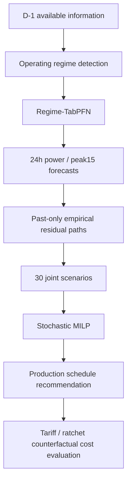

# 제6회 K-인공지능 제조데이터 분석 경진대회 결과 보고서 (초안)

> 초안 작성 2026-09-30. 대회 양식(휴먼명조 14, 줄간격 160)으로 옮기기 전 원고.
> 블라인드 평가: 소속·학교명·로고·저장소 주소·계정명은 넣지 않는다(성명·팀명만).
> `【오성민 작성】` 표시는 팀원 담당 부분(변수 정의표, 가이드북 요약, TabPFN·SARIMAX 등 예측 분포 비교)이다.
> 그림 번호 옆 경로는 `python run_all.py` 등으로 생성되는 파일이다.

---

## 표지

| 항목 | 내용 |
|---|---|
| 부문 | 일반국민/대학(원)생 |
| 프로젝트명 | 생산계획 기반 공장 전력 예측과 래칫 인지 피크 관리 |
| 팀명 | (팀명) |
| 선택 문제 | ⑤ 제조 생산데이터 기반 전력사용량 예측 및 최대피크 위험조건 분석 |

**내용 요약**

- 데이터 진단에서 **257일 중 115일이 증강 복제일**이고, `공장인원`이 전력으로 역산되는 **타깃 누수 열**임을 찾아 제거했다. 무작위 교차검증은 오차를 약 32% 과소평가했다. 시간순 검증과 원본-only sensitivity를 사용했고, Phase2 primary는 기존 harness와 동일하게 복제일을 포함했다.
- 최종 forecaster는 **Regime-TabPFN**이다. 동일 VALID 두 fold·두 target primary MAE가 기존 champion10.241→8.376(18.21%) 개선되어 TEST 전에 선정했다. 동결한 TEST primary 상대 개선은 7.05%이며 결과·CI와 한계는2.6절에 분리했다.
- 피크는 **전일 가동일의 주간조 시간**에 발생하고 기온과는 무관했다(상관 0.02). 한전 요금 구조를 반영하면 가장 큰 피크 시간(08시)은 경부하라 기본요금과 무관하고, 7월 한 번의 피크(7/19 11시 222kW)가 **래칫**으로 향후 12개월 기본요금을 결정한다(약 163만 원).
- 예측 오차 시나리오를 함께 고려하는 **래칫 인지 확률 MILP**로 생산을 최대 2시간 이동하는 계획을 세우면, 7월에는 7/19 래칫 갱신을 피해 하루 평균 11.2만 원(완전 예측의 96%), 평상시에는 하루 약 8~9천 원의 전력량요금을 줄인다. 강화학습·유전 알고리즘·타부 탐색도 같은 조건에서 비교했으나 MILP가 모든 조건에서 우세했다.
- 운영안: **전날 저녁 위험도 경보 + 권고 생산계획 → 당일 1시간 앞 예측으로 보정**. 요금 선택(Ⅱ가 최적), 소형 ESS(22kW/11kWh로 연 약 220만 원 기본요금 절감 가능) 판단 근거를 함께 제시한다.

---

## 제1장. 데이터 이해 및 진단 〔15점〕

### 1.1 데이터 개요
- 기간·단위: 2021-01-01 ~ 09-14, 1시간 단위 6,168행(257일). 각 행에 15분 단위 수요 4개(15·30·45·60분)와 시간 평균이 있다. 15분 값은 그 15분의 평균 수요(kW)로 본다(가정).
- 변수: 생산량, 공장인원, 인건비 배수(1.0/1.5), 전기요금(계절), 기온·풍속·습도·강수량, 날짜·요일·일·월.
- 생산 단위와 변수 의미, 공장 업종·설비: `【오성민 작성】 KAMP 데이터셋 가이드북 요약과 변수 정의표(의미·단위·범위·이상 여부)`

### 1.2 데이터가 나타내는 공정 상태
- **생산계획 = 가동 여부**: 생산량이 있는 날 159일은 예외 없이 가동(평균전력 70 이상)했다. 계획이 없는 날은 기저부하(약 21~23kW)이거나 토요일 부분 가동(약 45kW)이다. 예측 모델의 레짐 전환 구조는 이 관찰에서 출발한다.
- **주간조가 부하를 만든다**: 가동일 평균 15분 최대수요는 08~11시·13~16시에 150 안팎, 12시(점심) 107, 19시 이후 100 안팎이다(그림 pc1).
- **교대 구조**: 인건비 1.5배 구간(18~08시)과 야간 생산의 전력 기여가 작다는 점(1.5절)은 주·야간 설비 구성이 다름을 시사한다. `【오성민: 가이드북으로 확인】`

### 1.3 품질 진단과 처리

| 발견 | 근거 | 처리 |
|---|---|---|
| **증강 복제일** | 257일 중 **115일**이 앞선 날짜와 15분 수요 96값이 완전히 같다. 1~6월 대부분(1·4월 날짜가 원본), 7월 이후는 7/30(= 7/28 사본) 하나뿐. 일요일에 평일 곡선이 복사된 날도 있다 | 새 residual·decision 평가는 원본만, Phase2 forecasting primary는 legacy copy 포함(원본-only 보조). 학습에서는 복제일을 제외하거나 낮은 가중치(0.18~0.7, 검증으로 결정) |
| **타깃 누수 열** | `공장인원 = 생산량 ÷ (그 시간 15분 수요 4개의 합)`이 6,151행 전부에서 오차 4.9×10⁻⁹로 성립. 생산량과 인원을 알면 그 시간 전력이 역산된다. `평균`도 15분 값 평균(반올림)과 전 행 일치 | 공장인원과 파생 피처를 모두 제거. 제거 전 성능은 부풀려져 있었다(검증 MAE 8.6 → 제거 후 12.6, 레짐 LightGBM) |
| **시간 컬럼 손상** | 7/13·7/15 48행: `시간` 값이 전력값으로 덮이고(상관 0.91) 생산량·인원도 0으로 지워짐 | 모든 날짜가 정확히 24행이고 정상 행에서 시간 = 일내 순번이 100% 일치 → 순번으로 복원, 생산계획은 결측 처리 |
| 정전·전면휴무 | 8/28~29 전력 0 (17시간) | 학습·평가 제외 |
| 하계휴가 | 7/31~8/8 평일 포함 9일 기저부하 | 레짐 구조로 대응(검증 구간에 포함 → 운전 상태 전환 평가) |
| 결측 | 풍속 3, 강수량 1, 공장인원 17 | 선형보간 / 공장인원은 사용 안 함 |
| 요금 컬럼 | `전기요금(계절)` 109.8·167.2·191.6은 각각 어떤 계절 최대부하 단가 + 0.5와 맞지만, 계절 배정이 한전 기준과 어긋남(1~2월 = 봄·가을 값, 3~5·9월 = 겨울 값) | 피처로는 계절 지시값으로만, 비용 계산은 한전 요금표로 직접(4장) |
| 기상 | 일 최대수요와 일 최고기온 상관 0.02 | 기상 파생 피처는 검증에서 기각 |

### 1.4 검증 전략
- **시간순 분할**: 학습 1/8~7/15 · 검증 7/16~8/15(하계휴가 포함) · 테스트 8/16~9/14. 테스트는 모델·임계값 선택에 쓰지 않고 마지막에 한 번 평가(학습+검증으로 재학습).
- **복제일 누수 시연**(그림/표): 같은 학습 기간에서 교차검증 방식만 바꾸면

| 방식 | MAE | 복제일 | 원본일 |
|---|---|---|---|
| 무작위 시간 단위 5-fold | 11.24 | 8.68 | 15.06 |
| 날짜 단위 묶음 | 15.14 | 10.33 | 22.28 |
| 동일 곡선(복제 그룹) 묶음 | **16.43** | 12.09 | 22.89 |

무작위 교차검증은 오차를 **약 32% 과소평가**한다(복제일의 원본이 학습 fold에 들어감). `【오성민: 누수 분류 체계(Kapoor & Narayanan 2023)에 맞춘 누수 인포시트, 복제 그룹 블록 CV 보완】`
- **누수 감사 자동화**(6장): 원자료 항등식, 금지 열 부재, 미래 교란 검사(D일 실측을 바꿔도 D일 피처 불변), 시차 확인, 평가일이 학습 날짜의 사본이 아닌지 — 테스트 7개.

---

## 제2장. AI 예측모델 개발 및 성능평가 〔40점〕

### 2.1 예측 과제 정의 ("향후 지정된 시간구간")
- **하루 전 예측**: D-1일 자정에 D일 00~23시의 시간별 평균전력과 **15분 최대수요**(한전 최대수요전력 산정 단위)를 예측한다. 생산계획을 조정할 수 있는 마지막 시점이 전날이기 때문이다.
- 입력: 24시간 이상 지난 실측 전력, 당일 생산계획(전날 확정 가정), 달력·공휴일, 기상(예보로 대체 가능 가정).
- **예측 구간을 바꿔도 되나?**(그림 horizon_curve) H시간 앞 예측을 따로 학습해 비교했다.

| 전력 MAE | 1시간 앞 | 3 | 6 | 12 | 24시간 앞 |
|---|---|---|---|---|---|
| 테스트(평상 운전) | 6.29 | 6.01 | 6.62 | 6.62 | 6.54 |
| 검증(휴무·재가동 포함) | 6.69 | 8.64 | 10.12 | 11.23 | 11.19 |
| 지속 예측(H시간 전 값), 테스트 | 15.99 | 23.75 | 33.87 | 51.17 | 36.66 |

평상시에는 하루 전 예측이 1시간 앞 예측과 거의 같고(생산계획이 부하의 대부분을 설명), 운전 상태 전환기에는 당일 최신 실측이 오차를 40% 줄인다. → **전날 계획 + 당일 1시간 앞 보정**의 2단계 운영(4장).

### 2.2 비교 모델
| 모델 | 설명 |
|---|---|
| 전일 같은 시각 | 베이스라인 1 |
| 전주 같은 시각 | 베이스라인 2 |
| Ridge | 선형 회귀 |
| LightGBM 단일 | 모든 날을 하나의 모델로 |
| 레짐 전환 LightGBM | 생산계획으로 가동일/휴무일을 먼저 판별. 가동일 = LightGBM(L1), 휴무일 = 시간대별 중앙값 기저부하(원본 휴무일 13일뿐이라 학습형 모델이 과적합) |
| **레짐 전환 앙상블(기존 baseline)** | 가동일 타깃을 "직전 가동일 같은 시각 값 대비 잔차"로 학습, 복제일 저가중, LightGBM(L1, 3시드) 0.3 + ExtraTrees 0.7. 하이퍼파라미터·가중치는 두 검증 fold(7/2~7/15, 7/16~8/15)로만 결정(Optuna) |
| **Regime-TabPFN(VALID 선정 최종)** | 가동 TabPFN-v2/휴무 original median,46개 동일 피처. SARIMAX는 baseline, 일반 TabPFN은 제외. SimpleRNN/Chronos는 미구현 |

피처: 달력·공휴일, 시차(24·48·168시간), 직전 가동일 같은 시각 값, 생산계획(시간·일 생산량, ±1시간 평균, 가동 시작·종료 시각, 야간조, 운전 레짐), 기상.

### 2.3 기존 baseline 실험 기록 (최종 frozen 비교는 2.6절)
| 모델 | 검증 전력 | 검증 15분최대 | 테스트 전력 | 테스트 15분최대 | 테스트 일최대 |
|---|---|---|---|---|---|
| 전일 같은 시각 | 30.55 | 33.63 | 36.66 | 40.04 | 51.17 |
| 전주 같은 시각 | 43.11 | 47.20 | 8.26 | 9.73 | 10.07 |
| Ridge | 40.45 | 43.44 | 14.54 | 15.57 | 16.43 |
| LightGBM 단일 | 29.87 | 33.11 | 6.84 | 7.38 | **6.01** |
| 레짐 전환 LightGBM | 12.60 | 12.80 | 6.65 | 7.58 | 6.89 |
| **레짐 전환 앙상블** | **9.77** | **10.39** | **6.23** | **7.23** | 8.60 |

(그림 fig3 테스트 예측, fig1 데이터 개요)

**설계 선택의 근거(검증 전력 MAE, ablation)**
| 구성 | MAE |
|---|---|
| 생산계획 없음 | 34.60 |
| + 생산계획 (단일 LightGBM) | 29.87 |
| + 레짐 전환 | 12.60 |
| + 잔차 학습·복제일 저가중·앙상블 | **9.77** |

**차이가 우연이 아닌가**
- 날짜 단위 짝지은 부트스트랩(95% CI): 검증에서 앙상블 − 단일 LightGBM = −20.1 [−32.7, −9.5], 앙상블 − 레짐 LightGBM = −2.8 [−6.4, −0.1] (유의). 테스트에서 앙상블 − 단일 LightGBM = −0.59 [−1.27, +0.16] (유의하지 않음), 앙상블 − 전주 동일시각 = −2.0 [−3.2, −0.8] (유의).
- 롤링 원점 평가(7/12~9/13, 주 단위 10회, 그 주 이전 데이터로 학습):

| 모델 | 평균 MAE | 중앙값 | 1위 주 |
|---|---|---|---|
| **레짐 앙상블** | **8.69** | 7.24 | **6/10** |
| 레짐 LightGBM | 9.82 | 7.18 | 1/10 |
| LightGBM 단일 | 17.23 | 8.46 | 1/10 |
| 전주 같은 시각 | 24.15 | 10.02 | 2/10 |

- 예측 오차의 바닥: 1시간 전 실측까지 입력해도 테스트 MAE 6.16, 한 시간 안 15분 값 편차 평균 6.1 → 평상시 오차는 거의 노이즈 수준.

### 2.4 피크 위험 판정(분류 관점, F1)
이 절의 경보 임계값·분류기·P90 컨포멀 결과는 기존 baseline 실험이다. 새 Regime-TabPFN의 empirical uncertainty에는 이 보정을 옮기거나 TEST 이후 새로 적합하지 않았다. 새 시스템의 확률 결과는 4.5절에 별도로 기록한다.

평가표의 "이상 확률·F1"을 "목표수요(15분 수요 ≥ 190kW, 원본 기간 상위 5%) 초과"로 대응시켰다. 판정 임계값은 검증 구간에서만 결정.

| 일 단위 초과일 판정(테스트 30일 중 14일) | F1 | 재현율 | PR-AUC |
|---|---|---|---|
| 규칙: 평일 가동 주간이면 경보 | 0.743 | 0.93 | 0.61 |
| 전일 실측 | 0.316 | 0.21 | 0.49 |
| **예측 일최대(기존 baseline)** | **0.778** | **1.00** | **0.73** |
| 전용 분류기(등위 보정 확률) | 0.692 | 0.64 | 0.65 |

- 시간 단위 판정은 F1 0.38(정밀도 0.25)이 최선. 평일 일최대가 모두 183~204kW에 몰려 190이 분포 한가운데 걸리기 때문(3장).
- 불확실성: P90 상한의 실제 포함률 86% → 분할 컨포멀 보정 후 96%. `【오성민: 적응형 컨포멀(ACI), 분위수 예측 CRPS 비교】`

### 2.5 기존 baseline의 설계 근거 (최종 선택은 2.6절)
1. 기존 비교에서 낮은 오류를 보였던 champion baseline이다. 최종 모델은 두 VALID fold만으로 새로 선택했으며 TEST를 선택에 사용하지 않는다.
2. 휴무·재가동 같은 운전 상태 전환에서 무너지지 않음(하계휴가 주간 MAE 1.8 vs 단일 LightGBM 78.9)
3. 결정 가치: 7월(래칫 민감 구간)에 이 예측으로 세운 계획이 다른 예측기보다 하루 39% 더 절감(4장)
4. 일최대 수요 MAE만은 단일 LightGBM이 더 낮다 — 일 단위 경보에는 보완적으로 사용 가능

---

### 2.6 오성민: 동결한 Regime-TabPFN 최종 평가

최종 모델은 TEST를 보기 전에 VALID 두 fold·두 target MAE 평균으로 선택했다. Primary10.241→8.376(18.21%), fold별10.405→9.401/10.077→7.351, 원본 weekly rolling5주 중4주 개선/1주 동률이었다. 단순 weighted ensemble의 추가 이득은 사실상 없었다. 일반 TabPFN은 휴무를 포함한 Fold2에서 실패했고 SARIMAX는 nonconverged baseline으로만 보존했다. Chronos/SimpleRNN/stacking은 구현했다고 주장하지 않는다.

가동일은 original-history TabPFN-v2, 휴무일은 기존 시간별 median을 사용한다. 46개 피처, estimator4/median/cache/CPU4 threads/seed42, checkpoint revision 및 hash를 고정했다. TEST 이후 모델/weight/feature/uncertainty/제약을 변경하지 않았다.

| model | valid_primary | power_mae | peak15_mae | daily_max_mae | peak_hour_mae | primary_score |
|---|---|---|---|---|---|---|
| regime_ens | 10.241 | 6.225 | 7.229 | 8.605 | 8.047 | 6.727 |
| regime_tabpfn_all | 8.376 | 5.760 | 6.745 | 7.193 | 8.147 | 6.252 |

VALID와 TEST는 구간 난이도가 다르므로 절대 score끼리 직접 일반화 정도를 판단하지 않고 동일 TEST의 두 모델 차이를 비교한다. TEST primary 상대 개선=7.05%. VALID 선택 모델은 결과와 관계없이 Regime-TabPFN으로 유지한다.

| subset | mae_difference | ci_low | ci_high | n_days |
|---|---|---|---|---|
| overall | -0.457 | -1.170 | 0.190 | 30 |
| operating | -0.528 | -1.315 | 0.233 | 26 |
| peak_sensitive | 0.099 | -1.104 | 1.289 | 30 |

날짜 단위 paired CI5000회(seed42). Negative difference는 선택 모델의 개선이다. TEST의 CI는 결과 불확실성 설명이며 모델 재선택에 사용하지 않는다. 이 CI는 날짜를 동일 비중으로 평균하므로 일부 outage 시간이 제외된 날 때문에 hourly aggregate difference와 약간 다를 수 있다. 그림 `outputs/final_system/fig_test_daily_errors.png`.

## 제3장. 영향요인 및 오류분석 〔15점〕

### 3.1 피크(최대전력)가 발생하는 조건
(그림 pc1 시간대별, pc2 요일×월, pc3 일 생산시간, pc4 시간 내 15분)
- **전일 가동일에 난다**: 일 생산시간 13시간 이상인 날의 일최대 평균 189~191kW, 12시간 이하 126~139kW. 일최대와의 상관: 일 생산량 0.68, 일 생산시간 0.66, 일 최고기온 0.02.
- **주간조 시간에 난다**: 가동일 피크(≥190) 확률 08시 33%, 11시 27%, 13·14시 22%, 12시(점심) 0%, 19시 이후 거의 0.
- 가동 첫 시간(5.2%)보다 **생산이 이어지는 시간(9.4%)**이 더 위험 — 야간 부하 위에 주간 설비가 얹히는 구조(08시 안에서 15분 값 134 → 150kW).
- 피크 시간 안에서는 **뒤쪽 15분**(45·60분)에 최대가 찍힌다(181건 중 122건).
- 요일: 목요일 일최대 평균 195(최고), 토요일 126. 월: 7월·1월 높음.
- 출제 배경 요인과의 대응: 설비 동시 가동 → 주간 시간대·시간 내 후반 상승, 생산량 변화 → 일 생산시간·생산량, 교대 → 인건비 1.5 구간과 야간 부하, 계절 → 7월·1월. 제품 전환은 데이터에 없어 분석 불가(한계).
- **요금 관점**: 15분 수요 190 이상 시간의 **29%(73/253)는 요금상 경부하(08시)**라 기본요금과 무관. 기본요금에 반영되는 피크는 10~11시·13~16시.

### 3.2 주요 영향변수와 상호작용
이 절의 SHAP·DiCE는 기존 tree ensemble의 해석이다. Regime-TabPFN의 attribution을 계산한 결과로 표현하지 않는다.

(그림 fig5 SHAP 중요도, fig8 요약, fig9 의존도, fig10 상호작용 — 가동일 15분 최대수요, 오프셋 포함 정확 분해)
- 상위: 직전 가동일 같은 시각 피크·전력 → 가동 종료 이후 여부 → 전주 같은 시각 → 생산량(±1시간 평균) → 휴무 여부 → 가동 종료 시각.
- 상호작용 상위: 휴무 × 가동 종료 이후(3.80), 전주 피크 × 직전 가동일 전력(1.34), 시각 × 직전 가동일 피크(1.11), 월 × 생산량(0.98).
- **생산량 자체는 약한 레버**: DiCE 반사실로 예측 ≥ 185kW인 테스트 4시간을 목표수요 아래로 내리려면 해당 시간 생산을 중앙값 90% 줄여야 한다. 전력은 생산량보다 **가동 여부와 가동 시각**에 반응한다(4장 설계 근거).

### 3.3 기존 baseline이 잘 작동하는 조건과 실패하는 조건 (전력 MAE)
| 조건 | 검증 | 테스트 | 해석 |
|---|---|---|---|
| 휴무일 | 1.7 | 1.0 | 레짐 구조로 거의 완벽 |
| 평상 가동일 | 8.4 | 6.4 | 노이즈 수준 |
| **3일 이상 휴무 후 재가동일** | **24.4** | — | 모든 모델 실패(단일 LightGBM 22.8). 학습에 사례 없음 |
| **최대부하 요금 시간대** | 15.5 | 8.8 | 오차 최대. 요금상 가장 비싼 시간이라 중요 |
| 주간 피크대(08~11, 13~16시) | 12.7 | 7.6 | 과소예측 편향 |
| 생산량 501~1500 | 19.1 | 8.5 | 중간 생산량에서 오차 큼 |
| 월요일 | 12.2 | 9.7 | 주말 후 재기동 |
| 원본 학습 데이터가 적은 시점(7/12 주) | — | — | 롤링 평가에서 전주 값에 짐 |

### 3.4 미탐지(FN)·오경보(FP) — 비용으로 본 오류
- **미탐지 1건의 비용이 압도적이다.** 7/19 11시 222kW가 래칫 바닥을 206 → 222로 올려 **약 163만 원**(16kW × 8,320원 × 12개월)이 정해졌다. 7월 완전 예측 절감의 77%가 이 하루에서 나온다.
- 이날 평균 예측 기반 계획은 피크를 낮게 봐서 오히려 손해(−15만 원). P75 상한조차 바닥 근처로 올라가지 않아 **단일 예측으로는 사전 탐지 불가**였다.
- 오차 시나리오 기반 래칫 초과 확률로 경보하면(4장) 7/19는 26%로 "높음"이 되어 탐지된다. 합성 래칫 위험일 300개에서 비용 최소 임계값을 고르면 "항상 보호 계획"이 최적이었고, 그때 실제 적용 결과는 7월 FN 0건·FP 17일(오경보 비용 하루 약 1천 원 수준), 테스트 FP 25일(평상시 절감 9.3천 → 8.2천 원).
- 시간 단위 목표수요(190) 판정의 FP·FN은 평일 주간에 몰리며(그림 fig6, fig11 SHAP 사례), 원인은 1.3절의 좁은 분포다.

---

## 제4장. 현장 활용방안 〔10점〕

### 4.1 요금 구조 반영 (한전 산업용(을) 고압A 선택Ⅱ)
- 기본요금 8,320원/kW, 전력량요금(여름) 경부하 56.1·중간 109.0·최대 191.1원/kWh. 경부하 23~09시, 최대부하 10~12·13~17시(여름·봄·가을).
- 기본요금 적용전력 = 직전 12개월 중 동계(12~2월)·하계(7~9월)·당월 최대수요 중 최댓값(**래칫**). 이 데이터에서는 7/19 222kW 이후 8~9월 피크를 줄여도 기본요금은 줄지 않는다.
- 요금 출처는 공개 요금표 두 곳의 일치로 확인. 공식 문서 대조와 기후환경·연료비조정요금(모든 kWh에 동일 → 이동 효과에 무관)은 한계로 명시.

### 4.2 운영 절차 (전날 경보 → 당일 보정)
1. **전날 18시**: 내일 생산계획 입력 → 최종 모델이 시간별 전력·15분 최대수요 예측
2. 과거 예측 오차 경로를 더한 시나리오로 **래칫 초과 확률** 계산 → 위험 등급(낮음 < 5% ≤ 주의 < 20% ≤ 높음)
3. **확률 MILP**가 권고 생산계획 산출: 생산을 최대 2시간 늦추기만, 시간당 상한·가동 시작 횟수 유지, 일 총량 동일
4. 운영자 대시보드(그림 dashboard) 확인 후 채택/수정
5. **당일**: 1시간 앞 예측으로 오차를 보정하며 진행(2.1절, 운전 상태 전환 시 오차 40% 감소)

### 4.3 기존 시스템의 기대 효과 기록 (신규 TEST 통합 결과는 4.5절)
평가 방식: 전력(새 계획) = 실측 + 대리모형 변화분(시간대별 가동 이득·시동 효과·생산량). 결과는 실측이 아니라 **추정**이다.

| 정책 (하루 절감, 클수록 좋음) | 7월(래칫 민감) | 7/19 | 8~9월(래칫 고정) |
|---|---|---|---|
| 무조치 | 0 | 0 | 0 |
| MILP, 평균 예측 | 16,804원 | −151,899원 | 9,269원 |
| MILP, P75 상한 | 24,050원 | −21,465원 | 9,269원 |
| **확률 MILP(기존 실험)** | **111,707원** | **+1,634,756원** | **8,241원** |
| 완전 예측(상한) | 116,062원 | +1,634,756원 | 9,269원 |

- 8~9월에는 절감이 전부 **최대부하 → 중간·경부하 전력량요금 이동**(하루 약 8~9천 원, 월 22일 가동 시 약 18~20만 원).
- 7월 같은 래칫 갱신 위험 구간에는 **래칫 회피가 대부분의 가치**. 확률 MILP는 평상시 절감을 11% 포기하는 대신 연간 기본요금을 결정하는 사건을 막는다.
- **7/19 한 사건에 기대지 않는가**: 학습 구간 날에 래칫 바닥을 무작위로 둔 합성 위험일 300개(157일 초과)에서 확률 MILP 64,929원/일 vs 평균 예측 MILP 52,552원/일(+24%).

### 4.4 운영 유연성·인건비·계약·설비 판단
| 항목 | 결과 |
|---|---|
| 이동 허용 시간 | 평상시 1시간 3,862원 → 2시간 9,269원 → 3시간 14,742원(유연성 1시간 ≈ 하루 5,400원). 단 7월에 예측만 믿고 3시간까지 옮기면 −53,679원 → 유연성이 클수록 위험 인지 계획이 필요 |
| 인건비 할증(18~08시 1.5배) | 할증 단가를 넣어도 야간 생산을 주간으로 당기며 전력량요금 절감은 유지(9.3천 → 8.9천 원). ±2시간 안에서는 전력량요금·피크·인건비 상충이 약하다. 단가 미상이라 시나리오 값 |
| 요금 선택 | 같은 부하로 연간 환산: 선택Ⅰ 9,555만 · **Ⅱ 9,408만** · Ⅲ 9,520만 원 → Ⅱ가 최적. 현재 계약이 Ⅰ·Ⅲ이면 변경만으로 연 110~150만 원 |
| 소형 ESS | 최대수요를 22kW 낮추는 데 22kW/11kWh면 충분(방전 필요일 20일), 연 기본요금 약 220만 원 절감. 12kW/3kWh로도 연 약 120만 원. 설치비·효율·열화 미반영 → 회수기간 = 설치비 ÷ 연 절감으로 판단 |
| 현실성 한계 | 권고안이 점심(12시)에 생산을 넣는 경우가 있어 교대·휴게 운영 조정이 필요할 수 있음 |

---

### 4.5 오성민: 최종 forecasting → joint uncertainty → decision 연결

Phase1 empirical full-path/K30/lambda0는 그대로 유지했다. 두 forecaster의 residual을 같은 pre-TEST 원본 가동일·past-only origins에서 각각 새로 생성했다. 기존 champion residual을 새 모델에 재사용하지 않았다. TRAIN plan_missing은 Phase2 규칙대로 fitting에 포함하지만 residual/decision은 유효한 생산계획의 완전24h 원본 가동일만 평가한다. TEST actual은 fitting/residual pool에 들어가지 않으며 TEST 동안 pool 갱신도 없다.

| model | target | n_days | start | end | bias | mae |
|---|---|---|---|---|---|---|
| regime_ens | peak15 | 67 | 2021-01-28 | 2021-08-14 | -1.919 | 19.572 |
| regime_ens | power | 67 | 2021-01-28 | 2021-08-14 | -1.830 | 18.192 |
| regime_tabpfn_all | peak15 | 67 | 2021-01-28 | 2021-08-14 | -6.825 | 18.524 |
| regime_tabpfn_all | power | 67 | 2021-01-28 | 2021-08-14 | -4.918 | 17.877 |

| model | crps | power_crps | energy_score | variogram_score | tau_brier | ratchet_brier | coverage | interval_width | pinball |
|---|---|---|---|---|---|---|---|---|---|
| regime_ens | 6.989 | 6.338 | 43.702 | 1.764 | 0.060 | 0.017 | 0.947 | 55.009 | 3.358 |
| regime_tabpfn_all | 6.660 | 5.939 | 42.811 | 1.563 | 0.071 | 0.005 | 0.873 | 51.544 | 3.235 |

CRPS/coverage와 Energy/Variogram/event metrics는 decision-eligible 원본 가동일 peak15 중심이다(power CRPS 별도). 보고값은3개 사전 고정 seed의 날짜별 평균이다. Q10–Q90은 empirical scenario quantile이며 conformal guarantee가 아니다.

| system | n_days | saving_won | oracle_saving_won | regret_won | worst_day_saving | negative_saving_days | moved_share | energy_saving_won | ratchet_saving_won |
|---|---|---|---|---|---|---|---|---|---|
| regime_ens + empirical stochastic | 25 | 9,323.214 | 10,105.509 | 782.295 | 2,258.904 | 0 | 0.367 | 9,323.214 | 0.000 |
| regime_tabpfn_all + empirical stochastic | 25 | 9,538.963 | 10,105.509 | 566.546 | 2,258.904 | 0 | 0.367 | 9,538.963 | 0.000 |
| regime_tabpfn_all + point deterministic | 25 | 10,105.509 | 10,105.509 | 0.000 | 2,258.904 | 0 | 0.337 | 10,105.509 | 0.000 |

| metric | difference | ci_low | ci_high | n_days |
|---|---|---|---|---|
| saving_won | 215.749 | -525.351 | 1,080.519 | 25 |
| regret_won | -215.749 | -1,080.519 | 525.351 | 25 |

판단: **forecasting 개선, decision 차이는 CI로 확정할 수 없음**. B−A saving 차이=215.7원/일. Ratchet event는 0일/25일이다. Ratchet floor가 이미 높게 정해진 TEST에서는 TOU 절감과 rare ratchet 회피를 구분해야 한다. 7/19은 기존 VALID 사례이며 이 TEST 표와 섞거나 다시 튜닝하지 않았다.



이 절감은 실제 공장 intervention 결과가 아니라 실측 baseline+linear surrogate change에 기반한다. Forecast MAE가 낮아도 plan/regret 순위가 같다는 보장은 없다. 추천안과3seed별 결과는 production plans/daily decisions CSV, 그림은 `fig_test_decision_savings.png`, `fig_final_pipeline.png`에 있다.

## 제5장. 창의성 및 차별성 〔10점〕

각 방법이 2·3장 수치에 준 기여로 정리한다.

| 방법 | 기여(수치) |
|---|---|
| **데이터 진단: 복제일·누수 열 발견** | 무작위 CV의 32% 과소평가와 공장인원 역산 누수를 제거 → 모든 성능 수치가 정직해짐(누수 제거 시 검증 MAE 8.6 → 12.6로 드러남) |
| **생산계획 기반 레짐 전환 구조**(제조지식 결합) | 검증 MAE 29.9 → 12.6(휴무일 47.8 → 1.7), 롤링 10주 중 레짐 계열 7주 1위 |
| 잔차 학습·복제일 저가중·앙상블 | 12.6 → 9.8(검증), 6.65 → 6.23(테스트), 레짐 LightGBM 대비 유의(부트스트랩) |
| **결정 기반 평가** | 예측기를 MAE가 아니라 "그 예측으로 짠 계획의 실제 절감"으로 비교. 8~9월(래칫 고정)에는 어떤 예측이든 결정이 같고, 7월에만 예측이 돈이 됨을 보임(최종 모델 +39%) |
| **래칫 인지 확률 MILP**(불확실성 추정 → 결정) | 오차 시나리오를 함께 고려해 7/19 래칫 갱신 회피(+163만 원), 7월 완전 예측 가치의 96%. 합성 위험일 300개에서도 +24% |
| 예측 구간별 분석 | 하루 전 예측의 충분성과 당일 보정의 가치(전환기 −40%)를 근거로 2단계 운영 설계 |
| **정직한 비교**: 강화학습·GA·타부 | PPO는 탐색 중 래칫 손실이 커 "무조치"로 수렴, 행동 복제는 오차 누적, GA·타부는 LightGBM을 직접 최적화해도 MILP(선형 근사)에 못 미침(14,820 vs 12,524·10,749원). 0/50/100% 행동 공간의 표현력 한계를 원인으로 규명 → 최적화를 최종안으로 택한 근거 |
| 운영 대시보드·요금 선택·ESS | 모델 출력을 현장 판단(경보 등급, 권고 계획, 계약·설비 투자)으로 연결 |
| `【오성민】` TabPFN·SARIMAX·분위수·ACI | 사전학습 모델과 전통 시계열 대비, 분포 예측의 결정 가치(결정 기반 평가 표에 추가) |

---

## 제6장. 코드 구성 및 재현성 〔10점〕

### 6.1 실행
```
pip install -r requirements.txt
python run_all.py          # 전처리 → 학습 → 검증/테스트 → 오류분석 → 해석 → 그림 (CPU 약 3~10분)
pytest -q                  # 누수 감사 테스트 7개
```
추가 분석은 모듈별 독립 실행(`python -m src.decision_eval test`, `src.stochastic_milp`, `src.horizon`, `src.rolling_origin`, `src.dashboard 2021-07-19` 등, README 참고).

### 6.2 구성
| 경로 | 역할 |
|---|---|
| `run_all.py` | 전체 파이프라인, 테스트 예측 파일 생성 |
| `src/data.py`, `src/features.py` | 정제·복제일 탐지, 하루 전 피처 |
| `src/models.py`, `src/final_config.json` | 비교 모델과 최종 모델(튜닝 결과) |
| `src/tariff.py`, `src/milp.py`, `src/stochastic_milp.py` | 한전 요금·래칫, MILP, 확률 MILP |
| `src/decision_eval.py`, `src/eval_conditions.py`, `src/rolling_origin.py`, `src/horizon.py` | 평가 |
| `src/explain.py`, `src/peak_conditions.py`, `src/dashboard.py` | 해석·피크 조건·대시보드 |
| `src/rl_env.py`, `src/ratchet_rl.py`, `src/metaheuristics.py` | 강화학습·GA·타부 비교 |
| `experiments/` | 튜닝 스크립트와 결과(검증 fold로만 선택) |
| `tests/test_leakage.py` | 누수 감사 |

### 6.3 재현성 확인
- 새로 받은 코드와 빈 가상환경에서 requirements만 설치 → 테스트 7개 통과 → `run_all.py` 203초 완료, 수치 동일(테스트 MAE 6.23).
- 난수 고정(seed 42 등), 테스트 구간은 선택에 사용하지 않음.

### 6.4 테스트 예측 결과 파일
`outputs/test_predictions.csv` — 시각별 실측·예측 전력, 15분 최대수요 예측, 컨포멀 보정 상한, 운전 레짐, 위험일 경보, 일내 위험 순위. (제출 zip에 포함, 저장소에는 생성물로 제외)

---

최종 재현은 `docs/PHASE3_FINAL_SYSTEM.md`와 `experiments/final_system_config.json`을 따른다. 전체 pytest35 passed. TEST 실행 전 integration/config commit과 audit를 보존했다. 기존 run_all.py는 historical baseline 재현용이며 새 최종 시스템 entry point는 experiments.final_system이다.

TEST 결과 해석 보완: point primary MAE는 7.05% 감소했지만 날짜 paired CI는 0을 포함하고, peak-hour MAE는 8.047→8.147로 악화했다. Stochastic B−A 절감은 +216원/일, CI [−525,+1,081]로 확정적인 decision 개선 근거가 아니다. TEST에서는 ratchet floor가 전 날짜222kW이고 실제 초과0/25일이어서 ratchet Brier 개선은 false-positive 위험 감소를 나타내며 rare-event recall을 평가하지 못한다.

기존 solver의 에너지 목적항은 Σ rate·(forecast power−S(original)+S(new))다. Forecast power는 계획과 무관한 상수이므로 공통 surrogate 아래에서는 point power MAE 개선 자체가 TOU 계획을 바꾸지 않는다. 예측 차이의 결정 전달 경로는 peak15/ratchet 위험이다. Point-only deterministic MILP는 이번 TEST에서 oracle과 같은 평균10,106원/일 절감, regret0을 기록했고 stochastic 선택 시스템은9,539원/일, regret567이었다. 이는 무사건 TEST에서 uncertainty가 보수적 계획 비용을 만들었다는 관찰이며, TEST를 보고 policy를 재선택하거나 rare-event에서 deterministic의 우월성을 주장하지 않는다.

Residual pool은67일이고 초기 predictor의 작은 context부터 최종 TRAIN+VALID context까지 오차를 섞는다. TabPFN peak15 residual 평균−6.83kW의 비대칭과 context 크기 차이는 최종 모델 오차의 교환가능성에 한계가 있다. 사전 정의 pool을 유지했으며 사후 필터링/재보정하지 않았다.

## 한계
- 복제·증강 데이터라 실제 공장 운영 성능으로 일반화할 수 없다.
- 생산량을 전날 확정 계획으로 가정했다(실적이면 당일 누수). 시간별 계획 대신 일 단위 계획만 써도 테스트 MAE 약 7.2, 계획에 ±50% 잡음을 넣어도 약 6.9(누수 제거 전 측정, 재측정 필요).
- 기상은 실측을 썼다(예보 사용 시 약간 악화 가능).
- 피크 저감 효과는 선형 대리모형 기반 추정이다. 7/19 결과는 단일 사건이다.
- 인건비 단가, 실제 요금 선택, ESS 설치비는 데이터에 없어 시나리오로 다뤘다.

추가 한계: TabPFN pretrained prior/초기 weight 다운로드/CPU 비용, 작은 original residual sample, copy history, rare ratchet scarcity, 과거 repo의 TEST 재확인 기록, 신규 frozen TEST1회, surrogate counterfactual 및 실제 intervention 부재.

## 부록
- 설문 완료 화면 캡처 (필수, 제출 전 첨부)
- 그림 목록: fig1~fig11(`outputs/`), pc1~pc4(`outputs/peak_conditions/`), horizon_curve(`outputs/horizon/`), dashboard 2장(`outputs/dashboard/`)
